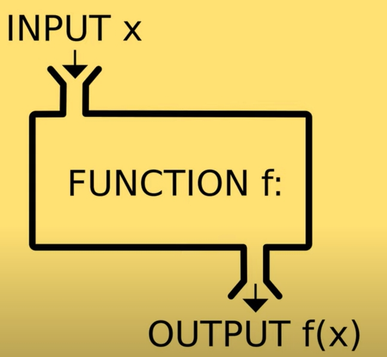

# JS- function(함수) , 내장 함수

## function(함수)

- 매개변수가 함수에 들어가서 `어떤 기능 처리 후 결과를 리턴`한다.
- 모든 함수는 return value 또는 return undefined가 정의되어 있으며 return undefined는 생략 가능하다.
- 함수 선언 : `function name(param1, param2,...){ body.... return; }`
- `하나의 함수는 한가지 일`을 위해 작성한다.
- 함수의 `이름은 동작`을 나타내는 것이 좋다. `doSomething, command, verb`
- 함수는 `object` 로 간주된다. 그러므로 변수에 할당할 수 있고, 파라미터로 전달할 수 있고, 리턴도 가능하다. (First-class Function)



- 함수 선언 : js 엔진은 함수 선언문을 맨 위로 올려준다. `함수 선언문 보다 먼저 함수를 호출할 수 있다`. (hoisted)
- 함수 표현 : 함수를 변수에 할당하여 할당된 변수를 호출하여 함수를 실행할 수 있다. 함수 표현은 `변수에 할당하기 전에는 함수를 호출 할 수 없다`.

<br />

> functions.js

```javascript
function printHello() {
  console.log('Hello');
}
printHelo();

function log(message) {
  console.log(message);
}

log('Hello@');
log(12345);

// parameters
// premitive parameters : passed by value
// object parameters: passed by reference

function changeName(obj) {
  obj.name = 'coder';
}

const kim = { name: 'kim' };
changeName(kim);
console.log(kim);

//default parameters(added in ES6)

function showMessage(message, from) {
  console.log(`${message} by ${from}`);
}

showMessage('hi'); //from undifined

function showMessage2(message, from = 'unknown') {
  console.log(`${message} by ${from}`);
}

showMessage2('hi'); //from unknown 출력

//Rest parameters (added in ES6) : 배열형태로 전달
function printAll(...args) {
  for (let i = 0; i < args.length; i++) {
    console.log(args[i]);
  }

  for (const arg of args) {
    console.log(arg);
  }

  args.forEach(arg => console.log(arg));
}

printAll('developer', 'coder', 'team');

// local scope
let globalMessage = 'global'; //전역변수
function printMessage3() {
  let message = 'hello'; //지역변수
  console.log(message);
  console.log(globalMessage);
}
printMessage3();
//console.log(message);//오류

//return a value
//console.log(sum(3,3)); //호출 가능(hoisted)
function sum(a, b) {
  return a + b;
}

const result = sum(1, 2);
console.log(`sum: ${sum(1, 2)}`);

//early return, early exit
//bad : {}안에서 긴 로직코드가 구현되면 가독성이 떨어진다.
function upgradeUser(user) {
  if (user.point > 10) {
    //long upgrade logic....
  }
}

//good :조건이 맞지 않을때 빨리 리턴 해서 함수 종료하고 조건이 맞을때만  로직을 구현한다.
function upgradeUser(user) {
  if (user.point <= 10) {
    //조건이 맞지 않을때
    return;
  }
  //long upgrade logic.....
}

//Function expression
//변수 에 함수 할당
//print(); //오류, 함수선언을 할당한 후 사용할 수 있다. hoisting이 안된다.

const print = function () {
  //anonymous function
  console.log('print');
};
print();

const printAgain = print;

printAgain();

const sumAgain = sum;

console.log(sumAgain(1, 2));

//callback function using function expression
//함수를 파라미터로 전달해서 상황에따라 호출한다 (callback function)
function randomQuiz(answer, printYes, printNo) {
  if (answer === 'love you') {
    printYes();
  } else {
    printNo();
  }
}

const printYes = function () {
  console.log('Yes !');
};

//named function
const printNo = function print() {
  //named function - 함수안에서 자신 스스로를 부룰때 쓸수 있다.
  console.log('No !');
};

randomQuiz('wrong', printYes, printNo);
randomQuiz('love you', printYes, printNo);

// ※Arrow function

//always anonymous , {} 생략 , 리턴 키워드 생략
// const simplePrint = function(){
//     console.log('simplePrint');
// };

const simplePrint = () => console.log('simplePrint');
const add = (a, b) => a + b;
const simpleMultiply = (a, b) => {
  //{}사용하면 리턴 키워드 사용해야 함
  //do something more
  return a + b;
};

//IIFE: Immediately Invoked Function Expression
//함수선언과 동시에 호출하기
(function hello() {
  console.log('IIFE');
})();
```

<br />

> /javascript/function/utility.js

```javascript
// utility.js
// 자주 사용되는 공통 함수를 정의

function p(str) {
  if (typeof str == 'undefined') {
    // 문자열이 없는 경우
    document.write('<br>');
  } else {
    document.write(str);
  }
}

function pl(str) {
  if (typeof str == 'undefined') {
    // 문자열이 없는 경우
    document.write('<br/>');
  } else {
    document.write(str + '<br/>');
  }
}
```

### 1. 함수의 호출

> /javascript/function/fun01.html

```javascript
<!DOCTYPE html>
<html>
    <head>
    <meta charset="UTF-8">
    <title>자바 스크립트 예제</title>
    <style type="text/css">
        *{
            font-family: gulim;
            font-size: 22px;
        }
    </style>
    <script type="text/javascript">
    //test1 함수의 정의
    function test1(){
        alert("함수가 실행되었습니다.");
    }
    </script>
    </head>

    <body>
    <H2>함수의 사용예 1</H2>

    <script language="javascript">
        //test1 함수를 실행
        test1();
    </script>
    </body>
</html>
```

<br />

### 2. 매개변수(Parameter, 함수로 전달 값)가 있는 함수의 호출

> /javascript/function/fun02.html

```javascript
<!DOCTYPE html>
<html lang="en">
<head>
    <meta charset="UTF-8">
    <meta http-equiv="X-UA-Compatible" content="IE=edge">
    <meta name="viewport" content="width=device-width, initial-scale=1.0">
    <title>Document</title>
    <style>
        * {
            font-family: gulim;
            font-size: 22px;
        }
    </style>
    <script>
        function pl(str){
            document.write(`value:${str}, type:${typeof str} <br>`);
        }
    </script>
</head>

<body>
    <h1>함수의 사용예 2</h1>
    <script>
        temp1 = 10;
        temp2 = '안녕하세요';
        pl('두번째 함수예제입니다.');
        pl(temp1);
        pl(temp2);
        pl(10.5);
        pl(true);
    </script>
</body>
</html>
```

### 3. 함수 실행 후 반환값이 있는 함수의 호출

> /javascript/function/fun03.html

```javascript
<!DOCTYPE html>
<html lang="en">
    <head>
        <meta charset="UTF-8">
        <meta http-equiv="X-UA-Compatible"  content="IE=edge">
        <meta name="viewport"   content="width=device-width, initial-scale=1. 0">
        <title>Document</title>
        <style>
            *{
                font-family: gulim;
                font-size: 22px;
            }
        </style>
        <script>
            function adding(x, y){
                let z = x + y;
                return z;
            }
            function pl(str){
                document.write(`${str} <br>`);
            }
        </script>
    </head>
    <body>
        <script>
            let a = 10;
            let b = 20;
            let c = adding(a,b);
            pl(`두변수의 합은 ${c}`);

            a = '야식이 건강 해치는 진짜 이유';
            b = '<br> - 소화불량, 숙면 방해 , 비만유발, 식도염 발생.....';
            c = adding(a, b);
            pl(`두변수의 합 ${c}`);
        </script>
    </body>
</html>
```

<br />

### 4. confirm 내장함수

- 사용자가 확인이나 취소버튼을 클릭할 경우 true나 false를 리턴하는 함수
- > /javascript/function/fun04.html

```javascript
<!DOCTYPE html>
<html lang="en">
<head>
    <meta charset="UTF-8">
    <meta http-equiv="X-UA-Compatible" content="IE=edge">
    <meta name="viewport" content="width=device-width, initial-scale=1.0">
    <title>Document</title>
    <style>
        * {
            font-family: gulim;
            font-size: 20px;
        }
    </style>
    <script src=./utility.js> </script>
</head>

<body>
    <h2>confirm의 사용 예제</h2>
    <script>
        let temp = window.confirm('확인 또는 취소를 선택하세요');

        if(temp){
            pl(`확인 선택: ${temp}`);
        }else{
            pl(`취소 선택: ${temp}`);
        }
    </script>
</body>
</html>
```

<br />

### 5. escape, unescape 내장 함수

- 숫자, 영문자를 제외한 한글등을 16진수 Unicode 형태로 인코딩(변환)하여 서버로 전송함, 변환을 하지 않으면 한글이 깨짐.

> /javascript/function/fun05.html

```javascript
<!DOCTYPE html>
<html lang="en">
<head>
    <meta charset="UTF-8">
    <meta http-equiv="X-UA-Compatible" content="IE=edge">
    <meta name="viewport" content="width=device-width, initial-scale=1.0">
    <title>Document</title>
    <style type="text/css">
        *{
            font-family: gulim;
            font-size: 22px;
        }
        </style>
    <script src='./utility.js'></script>
</head>
<body>
    <h1>escape, unescape 내장 함수</h1>
    <script>
        pl(`원본: 123-ABC-abc-미합중국/러시아/중국-!?#$% <br><br>`);
        let temp1 = escape('123-ABC-abc-미합중국/러시아/중국-!?#$%');
        let temp2 = unescape(temp1);
        pl(`escape: ${temp1} <br><br>`);
        pl(`unescape: ${temp2}`);
    </script>
</body>
</html>
```

<br />

### 6. isFinite 내장 함수

- 정상적인 숫자가 입력되면 true를 그렇지 않고 문자등이 입력되면 false를 리턴

> /javascript/function/fun06.html

```javascript
<!DOCTYPE html>
<html>
    <head>
        <meta charset="UTF-8">
        <title>자바 스크립트 예제</title>
        <style type="text/css">
            *{
                font-family: gulim;
                font-size: 22px;
            }
        </style>
        <script  src="./utility.js"></script>
    </head>

    <body>
    <h2>isFinite 함수 예제</h2>
        <script>
            let temp1, temp2;
            temp1 = prompt('값을 입력하세요',100);

            // alert(`${temp1}`);

            if(isFinite(temp1)==true){
                pl(`${temp1} 은 유한한 숫자`);
            }else{
                pl(`${temp1} 은 무한대이거나 숫자가 아님`);
            }
        </script>
    </body>
</html>
```

<br />

### 7. isNaN 내장 함수

- 입력된 값이 문자이면 true를 반환하고 그렇지 않고 숫자이면 false를 리턴

> /javascript/function/fun07.html

```javascript
<!DOCTYPE html>
<html>
    <head>
        <meta charset="UTF-8">
        <title>자바 스크립트 예제</title>
        <style type="text/css">
            *{
                font-family: gulim;
                font-size: 22px;
            }
        </style>
        <script src="./utility.js"></script>
    </head>

    <body>
        <h1> isNaN 함수 예제</h1>
        <script>
            let temp1 = prompt('값을 입력하세요', 100.5);
            //문자:true, 숫자:false
            if(isNaN(temp1)){
                pl(`${temp1} 은 문자 이다.`);
            }else{
                pl(`${temp1} 은 숫자 이다.`);
            }
        </script>
    </body>
</html>
```

<br />

### 8. 문자열 관련 함수 응용

> /javascript/function/fun08.html

```javascript
<!DOCTYPE html>
<html>
    <head>
        <meta charset="UTF-8">
        <title>자바 스크립트 예제</title>
        <style type="text/css">
            *{
                font-family: gulim;
                font-size: 22px;
            }
        </style>
        <script src="utility.js"></script>
    </head>

    <body>
        <h1>문자열함수 예제</h1>
        <strong>
            <script>
                let wc = 'KOREA VICTORY';
                let prn = wc.charAt(0);

                pl(prn);
                pl(wc.charAt(1));
                pl(wc.charAt(2));
                pl();
                pl(`V의 위치: ${wc.indexOf('V')}`)  ;
                pl(`R이 마지막으로 나타난 위치: ${wc.lastIndexOf('R')}`);
                pl(`문자열의 길이: ${'대한민국 WBC'.length}`);
                let tot = 10;
                pl(`tot+tot: ${tot+tot}`);
                pl(`parseInt: ${parseInt('10') + parseInt('10')}`);
            </script>
        </strong>
    </body>
</html>
```

<br />

### 9. 입력 값의 이동

> /javascript/function/value.html

```javascript
<!DOCTYPE html>
<html lang="en">
<head>
    <meta charset="UTF-8">
    <meta http-equiv="X-UA-Compatible" content="IE=edge">
    <meta name="viewport" content="width=device-width, initial-scale=1.0">
    <title>Document</title>
    <script>
        let oldVal = '';
        let newVal = '';

        function ok(f){
            if(oldVal === '' && newVal === ''){
                newVal = f.keyword.value;
            }else if(f.keyword.value === ''){
                return;
            }else{
                oldVal = newVal;
                newVal = f.keyword.value;
            }

            let divTag = document.getElementById('panel');

            let str = `oldVal: ${oldVal} /newVal: ${newVal}`;

           // divTag.innerHTML = divTag.innerHTML + '<br>' + str;
            divTag.append(`${str}`);
            divTag.innerHTML = divTag.innerHTML + '<br>'
        }
    </script>
</head>

<body>
    <form>
        <input type='text' name='keyword' value='' style='width:90%'>
        <button type='button' onclick='ok(this.form)'>확인</button>
    </form>
    <br />
    <div id='panel' style="font-size:24px"></div>
</body>
</html>
```

<br />

### 10. split 함수 응용

> /javascript/function/splitexam.html

```javascript
<!DOCTYPE html>
<html lang="en">
    <head>
        <meta charset="UTF-8">
        <meta http-equiv="X-UA-Compatible"  content="IE=edge">
        <meta name="viewport"   content="width=device-width,  initial-scale=1.0">
        <title>Document</title>
        <style type="text/css">
        *{
            font-family: gulim;
            font-size: 22px;
        }
        </style>
        <script src="./utility.js"></script>
    </head>

    <body>
        <h2>split() 함수</h2>
        <hr>
        <script>
            let dtolist = '가길동, 100, 90/나길동,  100, 90/다길동, 100, 90';
            let arraydto = dtolist.split('/');
            console.log(`배열길이: ${arraydto.length}`);

            for(let i=0; i < arraydto.length; i++){
                pl(`${arraydto[i]} <br>`);
            }
            pl('<hr>');
            pl(`<h1> <성적 계산 목록> </h1>`);

            for(let i=0; i < arraydto.length; i++){
                let str = arraydto[i].split(',')
                console.log(`배열의 타입 ${i}: ${typeof str[i]}`);
                pl(`성명: ${str[0]}`);
                pl(`영어: ${str[1]}`);
                pl(`수학: ${str[2]}`);

                let eng = parseInt(str[1]);
                let mat = parseInt(str[2]);

                pl(`총점 : ${eng + mat} `);
                pl(`평균 : ${(eng + mat)/2}`);
                pl('--------------------------');
            }
        </script>
    </body>
</html>
```
