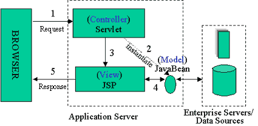

# MVC(Model, View, Controller) 모델, MVC 개발

## MVC(Model, View, Controller) 모델

### 1. 비즈니스 로직과 표현의 분리

- 장점

  - 디자이너는 `표현에 집중`하여 개발, 프로그래머는 `비즈니스 로직에 전념`하여 개발하므로 **효율성이 높아**진다.
  - 웹 응용프로그램의 `수정이 쉽다`.
  - 웹 응용프로그램의 `확장이 쉽다`.
  - 웹 응용프로그램의 `유지보수가 쉽다`.

- jsp와 javabeans로 개발한 경우는 비즈니스 로직과 표현을 **완전히 분리하기 쉽지 않을 뿐 아니라** 프로젝트 **규모가 커질수록 더욱 어려움 생긴다**.
- **이런 문제의 해결책**으로 `웹 응용프로그램을 비즈니스 로직과 표현으로 분리하여 개발하고자 하는 것`이 `MVC 모델`이다.

<br />

### 2. MVC 모델 정의

- MVC는 1979년 제록스 사 팔로 알토 연구소에서 스몰톡(SmallTalk)이라는 객체지향 언어를 사용한 사용자 인터페이스 개발에 소개된 개념으로 오랫동안 GUI(Graphical User Interface)개발 분야에서 사용된 개발 패턴이다.
- MVC는 새로운 개발 방법이 아니라 기존의 MVC 개발 모델이 웹 응용프로그램 개발에도 적합하다는 것이 입증되어, JSP개발자들에게 권고하는 개발 모델이다.
- `MVC는 모델`은 **웹 응용프로그램을 구성하는 서버 모듈**을 `사용자에게 보이는 표현`을 `뷰(View)`로, `자료와 비즈니스 로직 처리`를 `모델(Model)`로, 그리고 이들 `상호 간의 흐름을 제어`하는 `컨트롤러(Controller)`로 분리하여 개발하는 모델이다.


<br />

## MVC 개발

### 1. JSP+JavaBeans개발과 MVC 모델 구조

#### (1) Model 1(JSP+JavaBeans)의 구조


<br />

#### (2) Model2(MVC) 구조



<br />

#### (3) Controller의 처리순서

```
 Browser ---> Servlet(Controller)
                  1.HTTP 요청 받음, doGet(), doPost()메소드 자동호출
                  2.클라이언트가 요구하는 기능을 분석(방명록의 경우 글쓰기등)
                  3.요청한 비즈니스 로직처리하는 Model사용,Business Logic Class
                  4.결과를 request 또는 session의 setAttribute()메소드를 사용하여 저장
                  5.알맞은 뷰 선택
                  6.뷰로 포워딩(또는 리다이렉트),jsp 페이지로 이동
                ↙
              JSP
            ↙
        HTTP 응답
      ↙
 Browser
```

<br />

#### (4) Command Pattern에 기반한 Controller의 처리순서

- Command Handler
  - Interface, 추상 클래스의 형태
  - JSP Beans, EJB를 통해서 Command Handler를 구현합니다.

```
   Browser --------> Servlet(Controller)
                    1. HTTP 요청 받음
                    2. 클라이언트가 요구하는 기능을 분석
                    3. 로직을 처리할 명령어 핸들어 생성 ----> Command Handler
                    4. 명령어 핸들러를 이용해 로직 처리 ----> 로직 처리 (Class)
                                                              │
                                                              │
                                                              ↓
                                                            결과 저장
                                                              │
                                                              │
                                                              ↓
                                                            뷰 리턴
                                                              │
                                     ┌────────────────────────┘
                                     ↓
                           5. 명령어 핸들러가 리턴한 뷰로 포워딩(또는 리다이렉트)
                          ↙
                      JSP
                    ↙
               HTTP 응답
            ↙
   Browser
```

<br />

## MVC App 개발 순서

### 1. JSP + JavaBeans 개발 순서

① DBMS 설정<br />
② DTO(Data Transfer Object) Class 제작<br />
③ DAO(Data Access Object) Class 제작<br />
④ Service Class 제작<br />
⑤ Service/DAO test<br />
⑥ JSP 생성 연동<br />

<br />

### 2. MVC Web Application 개발 순서

① DBMS 설정<br />
② DTO(Data Transfer Object) Class 제작<br />
③ DAO(Data Access Object) Class 제작<br />
④ Service Class 제작<br />
⑤ Service/DAO test<br />
⑥ Servlet Controller 제작<br />
⑦ Action Interface 제작<br />
⑧ Action 구현 Class 제작<br />
. Service Class 연동<br />
⑨ JSP 생성 연동
