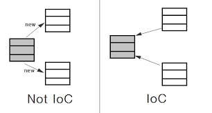

# Framework 개념, Spring Framework 특징, Spring Boot

## Framework 개념

### 1. Framework란

- 프레임워크의 사전적 의미는 뼈대, 틀로 소프트웨어 관점에서 접근하면 아키텍처에 해당하는 골격코드이다.
- 애플리케이션을 개발할 때, 가장 중요한 것이 전체 애플리케이션의 구조를 결정하는 아키텍처인데 이 아키텍처에 해당하는 골격 코드를 프레임워크가 제공한다.
- 프레임워크를 이용하여 개발하면, 개발자에게 모든 것을 위임하는 것이 아니라 애플리케이션의 기본 아키텍처는 프레임워크가 제공하고, 그 뼈대에 살을 붙이는 작업만 개발자가 한다.

### 2. 프레임워크의 장점

- 잘 만들어진 프레임워크를 사용하면 애플리케이션에 대한 분석, 설계,구현모두에게 재사용성이 증가하는데, 이를 통해 다음과 같은 장점을 얻을 수 있다.

#### (1) 빠른구현 시간

- 아키텍처에 해당하는 골격 코드를 제공받기 때문에 개발자는 비즈니스 로직만 구현하면되고 제안된 시간에 많은 기능을 구현할 있다.

#### (2) 쉬운 관리

- 같은 프레임워크가 적용된 애플리케이션들은 아키텍쳐가 같아서 관리가 쉽다. 결과적으로 유지보수에 들어가는 인력과 시간도 줄일 수 있다.

#### (3) 개발자들의 역량 획일화

- 숙련된 개발자와 초급 개발자는 지식과 경험이 달라 두 개발자의 소스의 품질은 당현히 다를 수밖에 없다. 하지만 프레임워크를 사용하면 숙련된 개발자와 초급 개발자가 생성한 코드가 비슷하다.
- 초급 개발자도 프레임워크를 통해서 세련되고 효율적인 코드를 생성해낼 수 있다.
- 관리자 입장에서 개발 인력을 더 효률적으로 구성할 수 있다.

#### (4) 검증된 아키텍처의 재사용과 일관성 유지

- 프레임워크에서 제공하는 아키텍처를 사용하므로 아키텍처에 관한 별다른 고민이나 검증 없이 소프트웨어를 개발 할 수 있다.
- 개발된 시스템은 시간이 지나도 유지보수 과정에서 아키텍처가 왜곡되거나 변형되지 않는다.

 

## Spring Framework

- 스프링 프레임워크는 로드 존슨(Rod Johnson)이 2004년에 만든 오픈소스 프레임워크이다.
- 스프링 프레임워크는 많은 디자인 패턴을 적용되어 배포되므로 프레임 워크를 이용하는 것 자체가 디자인 패턴을 사용하는 것이다.

### 1. Spring Framework의 특징

#### (1) 경량(Lightweight)

- 일반적인 J2EE 프레임워크 등 다른 프레임워크와 달리 객체간의 관계를 구성할 때 별도의 API를 등을 사용하지 않고 기존에 존재하는 라이브러리 등을 사용하기에 객체가 가볍다.

#### (2) 제어 역행(IoC: Inversion of Control)

- 기존에 자바 애플리케이션을 개발할 때 자바 객체를 생성하고 서로간 의존관계를 연결작업에 대한 제어권은 보통 개발되는 어플리케이션에 있었다.
- Servlet, EJB 등을 사용하는 경우 Servlet Container, EJB Container에게 제어권이 넘어가서 객체의 생명주기(Life Cycle)를 Container들이 전담하게 된다.
- IoC의 제어 역행이란 객체의 생성에서부터 생명주기의 관리까지 모든 객체에 대한 제어권이 바뀌었다는 것을 의미한다.

#### (3) 의존성 관리(DI : Dependency Injection)

- 의존성(Dependency)이라는 것은 하나의 객체가 다른 객체 없이 제대로 된 역할을 할 수 없다는 의미이다.
- 각각의 계층이나 서비스들 간에 의존성이 존재할 경우 프레임워크가 자동으로 관리한다.

#### (4) 관점 지향 프로그래밍(AOP : Aspect-Oriented Programming)

- 트랜잭션이나 로깅, 보안과 같이 여러 모듈에서 공통적으로 사용하는 기능의 경우 해당 기능을 분리하여 관리할 수 있다.
- 공통모듈의 반복적인 코드를 줄이고, 핵심 비즈니스 로직에만 집중할 수 있는 방법을 제공한다.

#### (5) 컨테이너

- 컨테이너는 특정 객체의 생성과 관리를 담당하며 객체 운용에 필요한 기능 제공
- 컨테이너는 일반적으로 서버안에 포함되어 배포 및 구동된다.
- 대표적인 컨테이너로는 Servlet 객체를 생성하고 관리하는 Servlet 컨테이너와 EJB객체를 생성하고 관리하는 EJB 컨테이너가 있다.
- Servlet 컨테이너는 톰캣서버에도 포함되어 있다.
- 애플리케이션 운용에 필요한 객체를 생성하고 객체 간의 의존관계를 관리한다는 점에서 스프링도 일종의 컨테이너라 할 수 있다.

 

## Spring Boot

- 현재의 스프링은 엔터프라이즈 시스템 개발에 필요한 분야를 지원하는 하나의 플랫폼으로 발전했다.
- 스프링은 다양한 기술들을 구현하기 위해 사용할 라이브러리가 많아졌고 그에 따라 관련 설정이 더욱 복잡해졌다.
- 이런 이유로 스프링을 처음 시작하는 사람들 대부분이 스프링의 복잡하고 방대한 설정에 대해 부담을 느끼는 경우가 많다.
- 복잡한 설정은 필연적으로 오류를 발생할 가능성이 높다.
- 기존 스프링을 통한 개발의 이런 문제점을 해결하기 위해 스프링 부트가 탄생했다.
- 기존 스프링이 학습에 어려움이 있기에 쉽게 배울 수 있도록 개발된 것이 스프링 부트이다.

### 1. 스프링 부트의 특징

- 웹서버를 내장하고 있어 복잡한 외적인 환경 설정과 실행을 간소화 했다. 따라서, 직접적인 개발과 상관이 적은 개발환경 설정보다는 개발 자체에 더 집중 할 수 있다.
- 스프링 부트로 프로젝트 생성을 위해 제공하는 스타터는 필요한 라이브러리들을 관련된 것끼리 묶어서 패키지를 제공한다.
- 스프링 부트가 자동으로 관련된 라이브러리들을 다운로드하고 라이브러리 사이의 의존성을 문제를 해결한다.
- 모든 빈( Bean)설정은 XML 이 아닌 어노테이션(annotation) 으로 처리한다.
