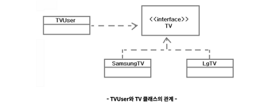
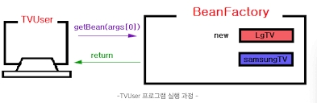
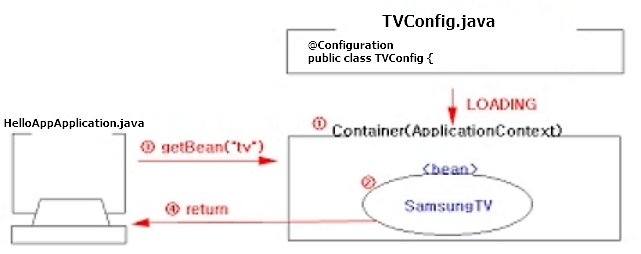

# IoC 컨테이너, 프로젝트 생성, 4가지 클래스 유형 실습

## IoC(Invesion of Control)컨테이너

- 스프링 프레임워크 이해하는데 중요한 부분이 컨테이너이다.
- 서블릿 컨테이너를 통해 스프링컨테이너의 동작방식을 유추한다.

### 1. Spring Boot Project 생성

Project Type : Spring Starter Project <br />
Name : HelloApp <br />
Type : Gradle <br />
Packaging : War <br />
Java Version : 8 <br />
Language : java <br />
Group, Artifact, Version, Description : 기본값 <br />
Package : com.example.demo (기본값) <br />
Library : 선택하지 않음

<br />

## 4가지 클래스 유형 실습

### 1. 결합도(Coupling)가 높은 클래스

- 결합도란 하나의 클래스가 다른 클래스와 얼마나 많이 연결되어 있는지를 나타내는 표현이며, 결합도가 높은 프로그램은 유지보수가 어렵다.
- SamsungTV와 LgTV의 시청에 필요한 필수 기능 네개가 있다.
- TVUser 클래스에서 두개 TV클래스를 사용하면 두 클래스의 메소드 원형이 다르기 때문에 TV 교체시 다변경해야 하므로 유지보수가 힘들어 지고, TV교체를 결정하기 쉽지 않다.
- src/main/java 패키지 만든 후 클래스 생성한다.

> coupling/SamsungTV.java

```java
package coupling;

public class SamsungTV {
  public void powerOn() {
    System.out.println("SamsungTV.....전원 켠다.");
  }

  public void powerOff() {
    System.out.println("SamsungTV.....전원 끈다.");
  }

  public void volumeUp() {
    System.out.println("SamsungTV.....소리 올린다.");
  }

  public void volumeDown() {
    System.out.println("SamsungTV.....소리 내린다.");
  }
}
```

> coupling/LgTV.java

```java
package coupling;

public class LgTV {
  public void turnOn() {
    System.out.println("LgTV.....전원 켠다.");
  }

  public void turnOff() {
    System.out.println("LgTV.....전원 끈다.");
  }

  public void soundUp() {
    System.out.println("LgTV.....소리 올린다.");
  }

  public void soundDown() {
    System.out.println("LgTV.....소리 내린다.");
  }
}
```

> coupling/TVUser

```java
package coupling;

public class TVUser {

  public static void main(String[] args) {
    SamsungTV tv = new SamsungTV();
    tv.powerOn();
    tv.volumeUp();
    tv.volumeDown();
    tv.powerOff();

    LgTV tv2 = new LgTV();
    tv2.turnOn();
    tv2.soundUp();
    tv2.soundDown();
    tv2.turnOff();
  }
}
```

<br />

### 2. 다형성 이용하기

- 결합도를 낮추기 위해서 객체지향 언어의 핵심 개념인 다형성(Polymorphism)을 이용한다. 결합도 높은 위의 예제를 수정한다.
- 다형성을 이용하려면 상속과 메소드 재정의(Overriding), 형변환이 필요하다.



<br />

> polymorphism/TV.java

```java
package polymorphism;

public interface TV {
  void powerOn();
  void powerOff();
  void volumeUp();
  void volumeDown();
}
```

> polymorphism/SamsungTV.java

```java
package polymorphism;

public class SamsungTV implements TV {
  public void powerOn() {
    System.out.println("SamsungTV.....전원 켠다.");
  }

  public void powerOff() {
    System.out.println("SamsungTV.....전원 끈다.");
  }

  public void volumeUp() {
    System.out.println("SamsungTV.....소리 올린다.");
  }

  public void volumeDown() {
    System.out.println("SamsungTV.....소리 내린다.");
  }
}

```

> polymorphism/LgTV.java

```java
package polymorphism;

public class LgTV implements TV{
  public void powerOn() {
    System.out.println("LgTV.....전원 켠다.");
  }

  public void powerOff() {
    System.out.println("LgTV.....전원 끈다.");
  }

  public void volumeUp() {
    System.out.println("LgTV.....소리 올린다.");
  }

  public void volumeDown() {
    System.out.println("LgTV.....소리 내린다.");
  }
}
```

> polymorphism/TVUser.java

```java
package polymorphism;

public class TVUser {
  public static void main(String[] args) {
    TV tv = new SamsungTV();
    tv.powerOn();
    tv.volumeUp();
    tv.volumeDown();
    tv.powerOff();

    tv = new LgTV();
    tv.powerOn();
    tv.volumeUp();
    tv.volumeDown();
    tv.powerOff();
  }
}
```

<br />

### 3. 디자인 패턴 이해하기

- 결합도를 낮추는 또하나의 방법으로 디자인패턴을 이용한다.
- TV를 교체할 때, 클라이언트 소스(TVUser.java)를 수정하지 않고 TV를 교체 한다면 유지보수는 더욱 편해진다.
- Factory패턴을 적용하여, 클라이언트에서 사용할 객체 생성을 캡슐화하여 TVUser와 TV 사이를 느슨한 결합 상태로 만들어준다.



<br />

> factory/TV.java

```java
package factory;

public interface TV {
  void powerOn();
  void powerOff();
  void volumeUp();
  void volumeDown();
}
```

> factory/SamsungTV.java

```java
package factory;

public class SamsungTV implements TV {
  public void powerOn() {
    System.out.println("SamsungTV.....전원 켠다.");
  }

  public void powerOff() {
    System.out.println("SamsungTV.....전원 끈다.");
  }

  public void volumeUp() {
    System.out.println("SamsungTV.....소리 올린다.");
  }

  public void volumeDown() {
    System.out.println("SamsungTV.....소리 내린다.");
  }
}
```

> factory/LgTV.java

```java
package factory;

public class LgTV implements TV{
  public void powerOn() {
    System.out.println("LgTV.....전원 켠다.");
  }

  public void powerOff() {
    System.out.println("LgTV.....전원 끈다.");
  }

  public void volumeUp() {
    System.out.println("LgTV.....소리 올린다.");
  }

  public void volumeDown() {
    System.out.println("LgTV.....소리 내린다.");
  }
}
```

> factory/BeanFactory.java

```java
package factory;

public class BeanFactory {
  public static TV getBean(String beanName) {
    if(beanName.equals("samsung")) {
      return new SamsungTV();
    } else if(beanName.equals("lg")) {
      return new LgTV();
    }
    return null;
  }
}
```

> factory/TVUser.java

```java
package factory;

public class TVUser {
  public static void main(String[] args) {
    TV tv = BeanFactory.getBean(args[0]);
    tv.powerOn();
    tv.volumeUp();
    tv.volumeDown();
    tv.powerOff();
  }
}
```

<br />

### 4. 스프링 IoC를 이용

- Ioc 컨테이너는 각 컨테이너에서 관리할 객체들를 위한 별도의 설정클래스(TVConfig.java)를 사용한다.
- 설정클래스는 HelloAppApplication 클래스와 같은 패키지에 만든다.
- HelloAppApplication 클래스는 시작 클래스 이며, 프로젝트가 시작될때 설정클래스에서 생성된 빈을 가져와 사용한다.



<br />

> ioc/TV.java

```java
package ioc;

public interface TV {
  void powerOn();
  void powerOff();
  void volumeUp();
  void volumeDown();
}
```

> ioc/SamsungTV.java

```java
package ioc;

public class SamsungTV implements TV {

  public SamsungTV() {
    System.out.println(">>>>> SamsungTV 객체 생성");
  }

  public void powerOn() {
    System.out.println("SamsungTV.....전원 켠다.");
  }

  public void powerOff() {
    System.out.println("SamsungTV.....전원 끈다.");
  }

  public void volumeUp() {
    System.out.println("SamsungTV.....소리 올린다.");
  }

  public void volumeDown() {
    System.out.println("SamsungTV.....소리 내린다.");
  }
}
```

> ioc/LgTV.java

```java
package ioc;

public class LgTV implements TV{

  public LgTV() {
    System.out.println(">>>>> LgTV 객체 생성");
  }

  public void powerOn() {
    System.out.println("LgTV.....전원 켠다.");
  }

  public void powerOff() {
    System.out.println("LgTV.....전원 끈다.");
  }

  public void volumeUp() {
    System.out.println("LgTV.....소리 올린다.");
  }

  public void volumeDown() {
    System.out.println("LgTV.....소리 내린다.");
  }
}
```

<br />

- @Configuration 어노테이션이 붙은 클래스는 스프링 설정으로 사용됨을 의미한다.
- @Bean 어노테이션이 붙은 메서드의 리턴값은 빈 객체로 사용됨을 의미한다.
- @Bean(name="samsung")은 빈으로 등록될 빈의 이름을 지정한다. 별도의 이름을 지정하지 않으면 메서드 이름이 빈의 이름으로 등록된다.

> com.example.demo/TVConfig.java

```java
package com.example.demo;

import org.springframework.context.annotation.Bean;
import org.springframework.context.annotation.Configuration;

import ioc.LgTV;
import ioc.SamsungTV;
import ioc.TV;

@Configuration
public class TVConfig {
  @Bean
  public TV lgCreate() {
    LgTV tv = new LgTV();
    return tv;
  }

  @Bean(name="samsung")
  public TV samsungCreate() {
    return new SamsungTV();
  }
}
```

- 자동으로 생성된 시작 클래스에 아래 코드를 추가한 후 실행한다.
- 파일 선택 -> Run AS -> Spring Boot App

> com.example.demo/HelloAppApplication.java

```java
package com.example.demo;

import org.apache.catalina.core.ApplicationContext;
import org.springframework.boot.SpringApplication;
import org.springframework.boot.autoconfigure.SpringBootApplication;
import org.springframework.context.annotation.AnnotationConfigApplicationContext;

import ioc.SamsungTV;
import ioc.TV;

@SpringBootApplication
public class HelloAppApplication {

	public static void main(String[] args) {
		//SpringApplication.run(HelloAppApplication.class, args);

	  // 추가적인 입력 부분
    // 1.IoC 컨테이너 생성
    AnnotationConfigApplicationContext context =
            new AnnotationConfigApplicationContext(TVConfig.class);

   // 2.LgTV Bean 가져오기
    TV lg = (TV)context.getBean("lgCreate");
    lg.powerOn();
    lg.volumeUp();
    lg.volumeDown();
    lg.powerOff();

    // 3.SamsungTV Bean 가져오기
    TV samsung = (TV)context.getBean("samsung", SamsungTV.class);
    samsung.powerOn();
    samsung.volumeUp();
    samsung.volumeDown();
    samsung.powerOff();
    }
}
```
