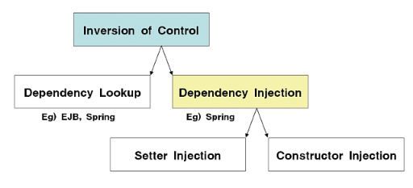
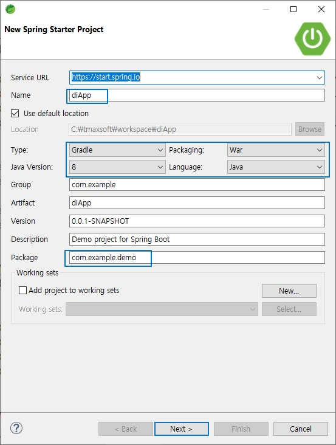
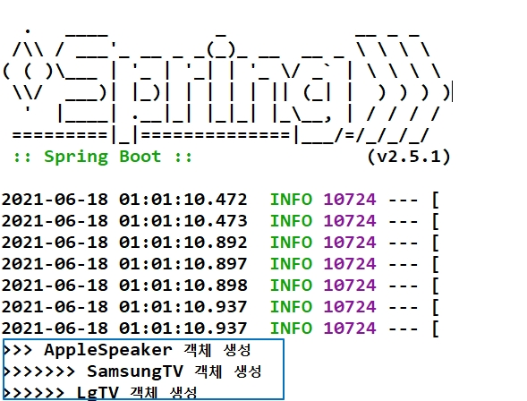

# 의존성 관리,DI(Dependency Injection)의 구현

## 의존성 관리

### 1. 스프링의 의존성 관리 방법

- 스프링 프레임워크는 객체 생성과 의존관계를 컨테이너가 자동으로 관리한다.
- 스프링 IoC의 핵심 원리이고 두 가지 형태로 지원한다.



- 컨테이너가 객체생성하고 클라이언트가 검색(Lookup)하여 사용하는 방식이 Dependency Lookup이다
- 실제 애플리케이션 개발과정에서 대부분 Dependency Injection을 사용한다.
- Dependency Injection은 객체 사이의 의존 관계를 프로그램 코드에 포함된 어노테이션 정보를 바탕으로 컨테이너가 자동으로 처리해 준다.
- 의존성 설정을 바꾸고 싶을때 프로그램 코드의 어노테이션 정보만 수정하여 변경사항을 적용할 수 있어 유지보수가 향상된다.

<br />

## Annotation DI(Dependency Injection)의 구현

### 1. Spring Boot Project 생성



<br />

### 2. 객체 자동 생성 및 주입

- `@Component`("samsungTV"): 컨테이너가 객체를 생성 해준다. 빈 이름은 samsungTV로 등록된다.
- `@Autowired` : DI 부분 AppleSpeaker 타입의 객체가 주입된다.
- `@Value`("400000") : 문자열, 기본형 타입의 값이 주입된다.

> ioc_di/AppleSpeaker.java

```java
package ioc_di;
import org.springframework.stereotype.Component;

@Component("apple")
public class AppleSpeaker {

  public AppleSpeaker() {
    System.out.println(">>> AppleSpeaker 객체 생성");
  }

  public void volumUp() {
    System.out.println("AppleSpeaker.......소리 올린다.");
  }

  public void volumDown() {
    System.out.println("AppleSpeaker........소리 내린다.");
  }
}
```

> ioc_di/TV.java

```java
package ioc_di;

public interface TV {
  void powerOn();
  void powerOff();
  void volumeUp();
  void volumeDown();
}
```

> ioc_di/SamsungTV.java

```java
package ioc_di;

import org.springframework.beans.factory.annotation.Autowired;
import org.springframework.beans.factory.annotation.Value;
import org.springframework.stereotype.Component;

@Component("samsungTV")
public class SamsungTV implements TV {
  @Autowired
  private AppleSpeaker speaker;

  @Value("400000")
  private int price;


  public SamsungTV() {
    System.out.println(">>>>> SamsungTV 객체 생성");
  }

  public void powerOn() {
    System.out.println("SamsungTV.....전원 켠다.(가격:"+price+")");

  }

  public void powerOff() {
    System.out.println("SamsungTV.....전원 끈다.");

  }

  public void volumeUp() {
    speaker.volumUp();

  }

  public void volumeDown() {
    speaker.volumDown();
  }
}
```

> ioc_di/LgTV.java

```java
package ioc_di;

import org.springframework.beans.factory.annotation.Autowired;
import org.springframework.beans.factory.annotation.Value;
import org.springframework.stereotype.Component;

@Component("lgTV")
public class LgTV implements TV {

  @Autowired
  private AppleSpeaker speaker;

  @Value("500000")
  private int price;

  @Override
  public void powerOn() {
    System.out.println("LgTV.....전원 켠다.(가격:"+price+")");

  }

  @Override
  public void powerOff() {
    System.out.println("LgTV....전원 끈다");

  }

  @Override
  public void volumeUp() {
    speaker.volumUp();

  }

  @Override
  public void volumeDown() {
    speaker.volumDown();
  }
}
```

<br />

### 3. Application 시작클래스에 패키지 등록 및 Controller 호출

- Application 클래스와 같은 패키지 내부에 포함되지 않을 경우 Ioc와 Di가 자동인식이 안된다.
- 시작 클래스에서 자동으로 Ioc와 Di가 인식하도록 외부 패키지를 등록한다.
- Spring Boot 프로젝트는 생성시 Packaging : War로 지정하면 Controller를 요청할 수 있는 웹 프로젝트가 만들어진다.
- Controller 클래스를 만들어 Ioc와 Di 를 테스트 한다.
- `@Qualifier` : 동일한 인터페이스를 구현한 클래스가 여러개 있는 경우 이름을 지정하여 명확하게 클래스를 인식할 수 있다.
- `@RequestMapping("/")` : 웹브라우저 주소창에 url 를 입력하면 이 어노테이션에 등록된 메서드가 호출된다.
- `@ResponseBody` : html 태그없이 문자열 데이터만 응답된다 (Json, xml등 Rest Api형태 응답)

> com.example.demo/DiAppAplication.java

```java
package com.example.demo;

import org.springframework.boot.SpringApplication;
import org.springframework.boot.autoconfigure.SpringBootApplication;
import org.springframework.context.annotation.ComponentScan;

@SpringBootApplication
@ComponentScan(basePackages= {"ioc_di"})
public class DiAppApplication {
	public static void main(String[] args) {
		SpringApplication.run(DiAppApplication.class, args);
	}
}
```

> ioc_di/DiContoller.java

```java
package ioc_di;

import org.springframework.beans.factory.annotation.Autowired;
import org.springframework.beans.factory.annotation.Qualifier;
import org.springframework.stereotype.Controller;
import org.springframework.web.bind.annotation.RequestMapping;
import org.springframework.web.bind.annotation.ResponseBody;

@Controller
public class DiController {
  @Autowired
  @Qualifier("samsungTV")
  private TV tv;

  @Autowired
  @Qualifier("lgTV")
  private TV tv2;

  @RequestMapping("/")
  public @ResponseBody String root() {

    tv.powerOn();
    tv.volumeUp();
    tv.volumeDown();
    tv.powerOff();

    tv2.powerOn();
    tv2.volumeUp();
    tv2.volumeDown();
    tv2.powerOff();

    return "Annotation DI 사용하기";
  }
}
```

<br />

### 4. 테스트

- diApp 프로젝트 선택 -> Run As -> Spring Boot App
- 실행 후 콘솔확인



- 브라우저에서 확인


- 브라우저 확인 후 변경된 콘솔 확인


