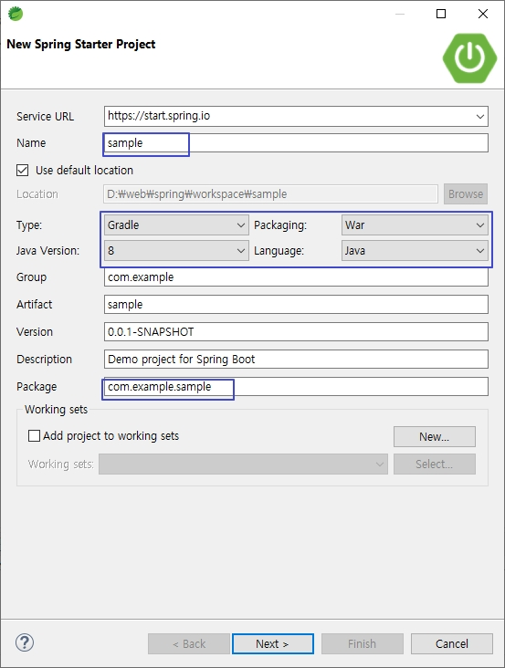
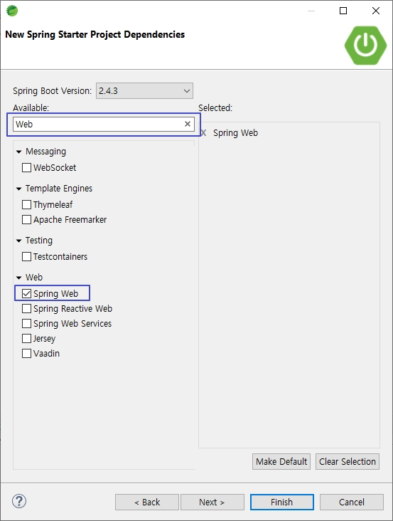
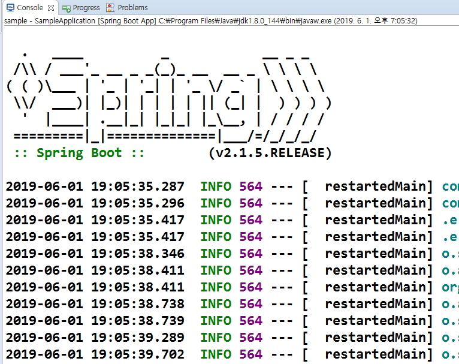
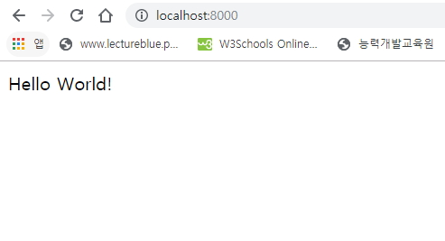
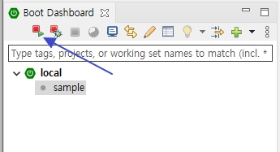
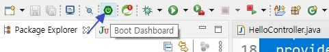

# sample 프로젝트 생성 후 Hello word 출력

## Spring boot 시작하기

### 1. 스프링 부트의 장점

- 프로젝트에따라 자주 사용되는 라이브러리들이 미리 조합되어 있다.
- 복잡한 설정을 자동으로 처리해 준다.
- 내장 서버를 포함해서 톰캣과 같은 서버를 추가로 설치하지 않아도 바로 개발이 가능하다.
- 톰캣이나 제티(Jetty)와 같은 웹 애플리케이션 서버(WAS Web Application Server)에 배포하지 않고도 실행할 수 있는 JAR 또는 WAR 파일로 웹 애플리케이션을 개발할 수 있다.
- sts는 기본적으로 빌드 도구 Maven을 내장하고 있지만, Maven의 xml문서는 양이 방대해지는 단점이 있으므로 설정이 간편하고 프로젝트별로 유연하게 설정할 수 있는 Gradle을 사용한다.

<br />

### 2. 스프링 부트로 프로젝트 생성하기

- File -> New -> Spring Starter Project 선택하여 새 스프링 부트 프로젝트 생성한다.



- [Next]을 선택하여 스프링 프레임워크의 다양한 라이브러리를 선택한다.
- DevTools는 스프링 부트 1.3부터 추가된 기능으로 개발 생산성 향상을 목표로 한다.
- Web 검색후 -> spring Web 선택
- Developer Tools -> Spring Boot DevTools



<br />

### 3. Hello word 출력할 HelloController 생성

- **[주의]자동으로 생성되는 SampleApplication 패키지의 하위패키지를 만든다.**
- src/main/java의 com/example/sample/controller 생성
- com/example/sample/controller/ HelloController 생성

> com.example.sample.controller/HelloController.java

```java
package com.example.sample.controller;

import javax.servlet.http.HttpServletRequest;

import org.springframework.stereotype.Controller;
import org.springframework.ui.Model;
import org.springframework.web.bind.annotation.GetMapping;
import org.springframework.web.bind.annotation.PathVariable;
import org.springframework.web.bind.annotation.RequestMapping;
import org.springframework.web.bind.annotation.RequestParam;
import org.springframework.web.bind.annotation.ResponseBody;

import com.example.sample.bean.Member;

@Controller
public class HelloController {

  @RequestMapping("/test4/{studentId}/{name}")
  public String getStudent(@PathVariable String studentId, @PathVariable String name, Model model) {
    model.addAttribute("id", studentId);
    model.addAttribute("name", name);
    return "test4";
  }

  @RequestMapping("/test3")
  public String test3(Member member, Model model) {
    // 파라미터와 일치하는 빈을 만들어서 사용할 수 있다.
    // View 페이지에서 model 을 사용하지 않고 member를 사용한다.
    // model.addAttribute("member", member); 파라메터로 저장해줘서(?) 생략해도된다
    return "test3";
  }

  @RequestMapping("/test2")
  public String test2(@RequestParam("id") String id, @RequestParam("name") String name, Model model) {
    // 파라미터가 많아지면 불편해진다.
    model.addAttribute("id", id);
    model.addAttribute("name", name);

    return "test2";
  }

  @RequestMapping("/test1")
  public String test1(HttpServletRequest httpServletRequest, Model model) {
    String id = httpServletRequest.getParameter("id");
    String name = httpServletRequest.getParameter("name");

    model.addAttribute("id", id); // request
    model.addAttribute("name", name);

    return "test1";
  }

  @GetMapping
  @ResponseBody
  public String hello() {

    return "Hello World!";
  }

  @GetMapping("/test")
  public String test() {
    return "test";
  }
}
```

<br />

### 4. Spring boot 프로젝트 sample 실행

- 기본 포트가 8080으로 Oracle XE 18c 포트와 충돌이 난다.
- Spring boot의 포트를 변경한다.

> src/main/resources/application.properties

```java
server.port = 8000
```

- sample 프로젝트 오른쪽 마우스 버튼 -> Run As -> Spring Boot App 선택하여 실행한다.
- console 결과



- 브라우저에서 http://localhost:8000을 주소창에 입력한다.



<br />

### 5. 스프링 부트 프로젝트 살펴보기

#### (1) 프로젝트의 주요 파일 및 구조

- src/main/java

  - 자바소스 폴더

- SampleApplication

  - 애플리케이션을 시작할 수 있는 main메소드가 존재하는 스프링 구성 메인 클래스

- src/main/resources/static

  - HTML, 스타일 시트, 자바스크립트, 이미지 등의 정적 리소스 폴더

- application.properties

  - 애플리케이션 및 스프링의 설정 등에서 사용할 여러 가지 프로퍼티(property)정의

- Project and External Dependencies :

  - Gradle에 명시된 프로젝트의 필수 라이브러리 모음

- src

  - JSP등 리소스 디렉토리

- build.gradle

  - Gradle 빌드 명세, 프로젝트에 필요한 라이브러리 관리, 빌드 배포 설정
  - 스프링 부트의 버전을 명시
  - 자바 버전 명시
  - 의존성 옵션
    - `implementation` : 의존 라이브러리 수정시 본 모듈까지만 재빌드(재컴파일)
    - `api` : 의존 라이브러리 수정시 본 모듈을 의존하는 모듈들도 재빌드(재컴파일)
    - `compileOnly` : compile 시에만 빌드하고 빌드 결과물에는 포함하지 않음
    - `runtime` : (실행)시 필요없는 라이브러리인 경우
    - `runtimeOnly` : runtime 시에만 필요한 라이브러리인 경우
    - `providedRuntime` : 실행시 제공되는 library
    - `testImplementation` : 테스트시 관련 library 제공

<br />

#### (2) SampleApplication 클래스

- 스프링 부트 애플리케이션의 구성과 실행을 담당하는 중요한 클래스이다.
- 스프링 부트의 장점 중 하나는 자동구성으로 기존의 복잡하고 다양한 스프링 설정을 제거하고 최소한의 설정으로 바로 실행할 수 있는 애플리케이션을 만들어 준다는 점이다.

> com.example.sample/SampleApplication.java

```java
package com.example.sample;

import org.springframework.boot.SpringApplication;
import org.springframework.boot.autoconfigure.SpringBootApplication;
import org.springframework.context.annotation.ComponentScan;

@SpringBootApplication
@ComponentScan(basePackages = { "com.example.*" })
public class SampleApplication {

  public static void main(String[] args) {
    SpringApplication.run(SampleApplication.class, args);
  }
}
```

- `@SpringBootApplication`는 스프링 부트의 핵심 어노테이션이며, 세 개의 스프링 부트 어노테이션으로 구성되어 있다.

`@EnableAutoConfiguration` : 스프링의 다양한 설정을 자동으로 구성한다.
`@ComponentScan` : 컴포넌트 클래스를 검색하고 검색된 컴포넌트 및 클래스를 스프링 애플리케이션 컨텍스트에 등록한다.
`@Configuration` : 자바기반 설정 파일임을 의미한다.(XML설정대신 사용)

- main메소드는 스프링 부트의 SampleApplication.run() 메소드를 사용하여 스프링부트 프로젝트 애플리케이션을 실행할 수 있게 한다.

<br />

#### (3) build.gradle

- Gradle로 생성된 프로젝트의 빌드를 관리하는 파일이다.

> build.gradle

```java
plugins {
	id 'org.springframework.boot' version '2.7.0'
	id 'io.spring.dependency-management' version '1.0.11.RELEASE'
	id 'java'
	id 'war'
}

group = 'com.example'
version = '0.0.1-SNAPSHOT'
sourceCompatibility = '11'

repositories {
	mavenCentral()
}

dependencies {
	implementation 'org.springframework.boot:spring-boot-starter-web'
	developmentOnly 'org.springframework.boot:spring-boot-devtools'
	providedRuntime 'org.springframework.boot:spring-boot-starter-tomcat'
	testImplementation 'org.springframework.boot:spring-boot-starter-test'
	implementation 'javax.servlet:jstl'
    implementation 'org.apache.tomcat.embed:tomcat-embed-jasper'
    implementation 'org.springframework.boot:spring-boot-starter-validation'
}

tasks.named('test') {
	useJUnitPlatform()
}
```

<br />

### (4) 서버 재실행

- sts 왼쪽 하단 [Boot Dashboard]에서 프로젝트 선택후 시작아이콘으로 한다.



- [Boot Dashboard] 안보이면 상단에 다음 아이콘을 클릭하여 나타낸다.


