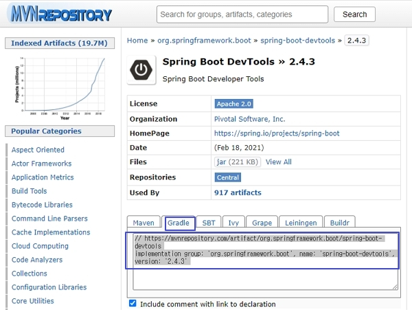
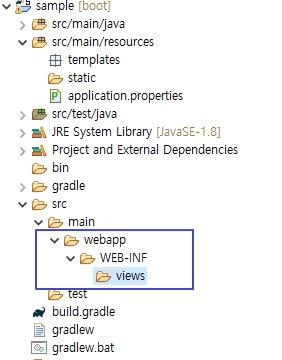

# 개발편의 모듈 설정, JSP 설정

## Boot Project sample 에서 여러가지 설정

- sample boot project에서 작업

### 1. 개발편의 모듈 devtools 설정

- devtools(Developer Tools)는 스프링 부트에서 제공하는 개발 편의를 위한 모듈이다.
- 주로 변경된 코드를 서버 또는 화면에 신속하게 반영해 결과를 확인하기 위해서 사용한다.
- 프로젝트 생성시 라이브러리 선택을 못했을 경우는 저장소에서 검색하여 추가한다.

#### (1) http://mvnrepository.com

- 저장소에서 spring-boot-devtools 검색(Spring version 2.4.3과 일치를 권장)



<br />

#### (2) 설정 추가

- build.gradle에 dependencies {}안에 추가한다.

> build.gradle

```java
dependencies {
    implementation 'org.springframework.boot:spring-boot-starter-web'
    providedRuntime 'org.springframework.boot:spring-boot-starter-tomcat'
    testImplementation 'org.springframework.boot:spring-boot-starter-test'

    // https://mvnrepository.com/artifact/org.springframework.boot/spring-boot-devtools
    implementation group: 'org.springframework.boot', name: 'spring-boot-devtools', version: '2.4.3'
}
```

- /src/main/resources/application.properties 변경

> application.properties

```java
server.port = 8000
# DEVTOOLS (DevToolsProperties)
spring.devtools.livereload.enabled=true
```

<br />

#### (3) Gradle refresh

- build.gradle 선택 -> Gradle -> Refresh Gradle Project

<br />

### 2. JSP 실행 설정

#### (1) jsp 사용을 위한 설정추가

- 톰캣이 jsp파일을 컴파일할 수 있도록 만들어주는 라이브러리 추가
- build.gradle에 등록 후 Refresh Gradle Project 한다.
- application.properties에 JSP사용이 가능하도록 설정한다.

> build.gradle

```java
dependencies {
    implementation 'org.springframework.boot:spring-boot-starter-web'
    providedRuntime 'org.springframework.boot:spring-boot-starter-tomcat'
    testImplementation 'org.springframework.boot:spring-boot-starter-test'

    // https://mvnrepository.com/artifact/org.springframework.boot/spring-boot-devtools
    implementation group: 'org.springframework.boot', name: 'spring-boot-devtools', version: '2.4.3'
    implementation 'javax.servlet:jstl'
    implementation 'org.apache.tomcat.embed:tomcat-embed-jasper'
}
```

> application.properties

```java
server.port = 8000
#DEVTOOLS (DevToolsProperties)
spring.devtools.livereload.enabled=true
#jsp 설정
spring.mvc.view.prefix=/WEB-INF/views/
spring.mvc.view.suffix=.jsp
```

<br />

#### (2) JSP 파일이 위치할 폴더 생성

- src/main 폴더에 webapp/WEB-INF/views 폴더 생성



<br />

#### (3) JSP파일 생성

- views/test.jsp 파일 생성

> test.jsp

```java
<%@ page language="java" contentType="text/html; charset=UTF-8"
	pageEncoding="UTF-8"%>
<%@ taglib prefix="c" uri="http://java.sun.com/jsp/jstl/core"%>
<!DOCTYPE html>
<html>
<head>
<meta charset="UTF-8">
<title>Insert title here</title>
<meta name="viewport" content="width=device-width, initial-scale=1">
<link rel="stylesheet"
	href="https://maxcdn.bootstrapcdn.com/bootstrap/3.4.1/css/bootstrap.min.css">
<script
	src="https://ajax.googleapis.com/ajax/libs/jquery/3.5.1/jquery.min.js"></script>
<script
	src="https://maxcdn.bootstrapcdn.com/bootstrap/3.4.1/js/bootstrap.min.js"></script>
</head>
<body>
	<div class="container">
		<h2>시원한 풍경 사진</h2>
		<p>이미지 파일을 보여줍니다.</p>
		
		<br>
		<h1>JSTL 결과 출력하기</h1>
		<c:set var="season" value="봄이 도착했습니다."></c:set>
		<h3>JSTL 출력:${season}</h3>
	</div>
</body>
</html>
```

<br />

#### (4) Controller 작성

- src/main/java폴더의 HelloController 수정
- RestController는 기본적으로 @ResponseBody를 가지고있다.
- Controller로 변경후 문자열 리턴시 @ResponseBody를 명시한다.

> HelloController.java

```java
package com.example.sample.controller;

import javax.servlet.http.HttpServletRequest;

import org.springframework.stereotype.Controller;
import org.springframework.ui.Model;
import org.springframework.web.bind.annotation.GetMapping;
import org.springframework.web.bind.annotation.PathVariable;
import org.springframework.web.bind.annotation.RequestMapping;
import org.springframework.web.bind.annotation.RequestParam;
import org.springframework.web.bind.annotation.ResponseBody;

import com.example.sample.bean.Member;

@Controller
public class HelloController {

  @RequestMapping("/test4/{studentId}/{name}")
  public String getStudent(@PathVariable String studentId, @PathVariable String name, Model model) {
    model.addAttribute("id", studentId);
    model.addAttribute("name", name);
    return "test4";
  }

  @RequestMapping("/test3")
  public String test3(Member member, Model model) {
    // 파라미터와 일치하는 빈을 만들어서 사용할 수 있다.
    // View 페이지에서 model 을 사용하지 않고 member를 사용한다.
    // model.addAttribute("member", member); 파라메터로 저장해줘서(?) 생략해도된다
    return "test3";
  }

  @RequestMapping("/test2")
  public String test2(@RequestParam("id") String id, @RequestParam("name") String name, Model model) {
    // 파라미터가 많아지면 불편해진다.
    model.addAttribute("id", id);
    model.addAttribute("name", name);

    return "test2";
  }

  @RequestMapping("/test1")
  public String test1(HttpServletRequest httpServletRequest, Model model) {
    String id = httpServletRequest.getParameter("id");
    String name = httpServletRequest.getParameter("name");

    model.addAttribute("id", id); // request
    model.addAttribute("name", name);

    return "test1";
  }

  @GetMapping
  @ResponseBody
  public String hello() {

    return "Hello World!";
  }

  @GetMapping("/test")
  public String test() {
    return "test";
  }
}
```

#### (5) 실행하기

- sample -> Run As -> Spring Boot App


