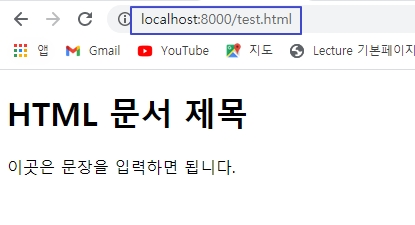
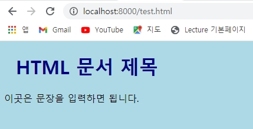
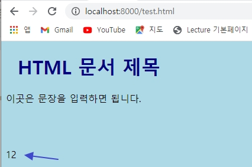

# HTML, CSS, JS, JSTL 실행 및 이미지 출력

## HTML, CSS, JS, JSTL 실행 및 이미지 출력

### 1. HTML 출력

- src/main/webapp폴더에 test.html작성

> src/main/resources/static/test.html

```html
<!DOCTYPE html>
<html>
  <head>
    <meta charset="UTF-8" />
    <title>Insert title here</title>
    <link href="/css/style.css" rel="stylesheet" />
  </head>
  <body>
    <h1>HTML 문서 제목</h1>
    <p>이곳은 문장을 입력하면 됩니다.</p>
    <br />
    <br />
    <p id="demo"></p>
    <script type="text/javascript" src="/js/function.js"></script>
  </body>
</html>
```

- 실행 결과



<br />

### 2. CSS 실행

- src/main/resources 아래 static 폴더에 css/style.css작성

> src/main/resources/static/css/style.css

```css
body {
  background-color: lightblue;
}

h1 {
  color: navy;
  margin-left: 20px;
}
```

- 실행 결과



<br />

### 3. JS 실행

- src/main/resources 아래 static 폴더에 JS/functions.js작성

> src/main/resources/static/js/function.js

```js
function myFunction(p1, p2) {
  return p1 * p2;
}
document.getElementById('demo').innerHTML = myFunction(4, 3);
```

- 실행결과



<br />

### 4. JSTL, image 출력

- JSP에서 JSTL사용과 image를 출력한다.
- src/main/resources의 static 폴더에 images폴더 생성후 이미지파일 저장
- views/test.jsp파일을 jstp, image 출력되도록 수정한다.

> test.jsp

```jsp
<%@ page language="java" contentType="text/html; charset=UTF-8"
	pageEncoding="UTF-8"%>
<%@ taglib prefix="c" uri="http://java.sun.com/jsp/jstl/core"%>
<!DOCTYPE html>
<html>
<head>
<meta charset="UTF-8">
<title>Insert title here</title>
<meta name="viewport" content="width=device-width, initial-scale=1">
<link rel="stylesheet"
	href="https://maxcdn.bootstrapcdn.com/bootstrap/3.4.1/css/bootstrap.min.css">
<script
	src="https://ajax.googleapis.com/ajax/libs/jquery/3.5.1/jquery.min.js"></script>
<script
	src="https://maxcdn.bootstrapcdn.com/bootstrap/3.4.1/js/bootstrap.min.js"></script>
</head>
<body>
	<div class="container">
		<h2>시원한 풍경 사진</h2>
		<p>이미지 파일을 보여줍니다.</p>
		 <br>
		<h1>JSTL 결과 출력하기</h1>
		<c:set var="season" value="봄이 도착했습니다."></c:set>
		<h3>JSTL 출력:${season}</h3>
	</div>
</body>
</html>
```
