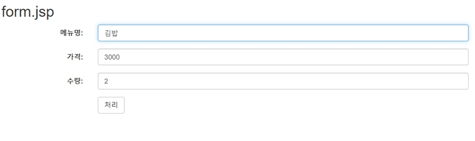
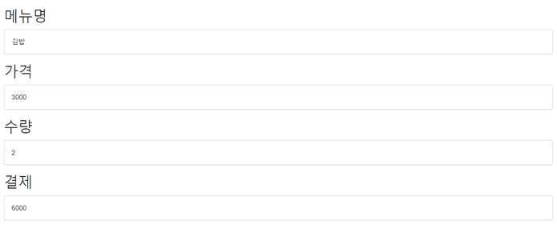
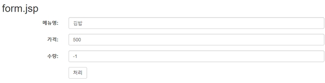

# Form 값의 검증, Validator interface 사용

## Form 값의 검증, Validator interface 사용

- 검증시 사용자 입력의 에러는 Javascript로 검증하여 에러 메시지 출력
- 정상적인 폼을 우회하여 전송된 데이터 검증을 위하여 Controller에서 재검증
- sample project 계속 사용
- build.gradle 에 Validator 라이브러리 추가
- Gradle -> Refresh Gradle Project

> build.gradle

```
dependencies {
    implementation 'org.springframework.boot:spring-boot-starter-web'
    developmentOnly 'org.springframework.boot:spring-boot-devtools'
    providedRuntime 'org.springframework.boot:spring-boot-starter-tomcat'
    testImplementation 'org.springframework.boot:spring-boot-starter-test'
    implementation 'javax.servlet:jstl'
    implementation 'org.apache.tomcat.embed:tomcat-embed-jasper'
    implementation 'org.springframework.boot:spring-boot-starter-validation'
```

<br />

### 1. VO Class

> CalcVO.java

```java
package com.example.validator;

public class CalcVO {
  private String menu;
  private int price;
  private int count;
  private int payment;

  public String getMenu() {
    return menu;
  }

  public void setMenu(String menu) {
    this.menu = menu;
  }

  public int getPrice() {
    return price;
  }

  public void setPrice(int price) {
    this.price = price;
  }

  public int getCount() {
    return count;
  }

  public void setCount(int count) {
    this.count = count;
  }

  public int getPayment() {
    return payment;
  }

  public void setPayment(int payment) {
    this.payment = payment;
  }
}
```

<br />

### 2. Validator class

- 유효성 검증 클래스 선언

> CalcValidator.java

```java
package com.example.validator;

import org.springframework.validation.Errors;
import org.springframework.validation.Validator;

public class CalcValidator implements Validator {
  @Override
  public boolean supports(Class<?> clazz) {
    // 검증할 객체의 클래스 타입 정보 명시
    return CalcVO.class.isAssignableFrom(clazz);
  }

  @Override
  public void validate(Object target, Errors errors) {
    CalcVO calcVO = (CalcVO) target;
    String menu = calcVO.getMenu();
    if (menu == null || menu.trim().isEmpty()) {
      System.out.println("menu가 등록이 누락되었습니다.");
      errors.rejectValue("menu", "error"); // 임의 값 지정 가능, 에러 발생을 나타냄
    }

    int price = calcVO.getPrice();
    if (price < 1000 || price >= 10000000) {
      System.out.println("금액은 1000원이상 천만원 이하여야합니다.");
      errors.rejectValue("price", "error");
    }

    int count = calcVO.getCount();
    if (count <= 0 || count >= 1000) {
      System.out.println("수량은 1개이상 천개 이하여야합니다.");
      errors.rejectValue("count", "error");
    }
  }
}
```

<br />

### 3. Controller class

> CalcController.java

```java
package com.example.validator;

import java.util.HashMap;
import java.util.Map;

import javax.validation.Valid;

import org.springframework.stereotype.Controller;
import org.springframework.ui.Model;
import org.springframework.validation.BindingResult;
import org.springframework.web.bind.annotation.GetMapping;
import org.springframework.web.bind.annotation.PostMapping;

@Controller
public class CalcController {

  public CalcController() {
    System.out.println(">>> CalcController created.");
  }

  @GetMapping("/calc3")
  public String calc3() {
    return "/calc/form3";
  }

  @PostMapping("/calc3")
  public String calc3(@Valid CalcVOAnnotation calcVO, BindingResult result, Model model) {

    Map<String, String> map = new HashMap<String, String>(); // 에러 메세지 저장

    if (result.hasErrors()) { // 에러 발생시
      if (result.getFieldError("menu") != null) {
        map.put("menu", "menu 등록이 누락되었습니다.");
      }
      if (result.getFieldError("price") != null) {
        map.put("price", result.getFieldError().getDefaultMessage());
      }
      if (result.getFieldError("count") != null) {
        map.put("count", "수량은 1개이상 천개 이하여야합니다.");
      }
      return "/calc/form2"; // 폼으로 리턴
    } else { // 에러 미발생시
      int payment = calcVO.getPrice() * calcVO.getCount();
      model.addAttribute("payment", payment);
      return "/calc/proc";
    }
  }

  @GetMapping("/calc2")
  public String calc2() {
    return "/calc/form2";
  }

  @PostMapping("/calc2")
  public String calc2(CalcVO calcVO, BindingResult result, Model model) {

    CalcValidator validator = new CalcValidator();
    validator.validate(calcVO, result); // 검증
    Map<String, String> map = new HashMap<String, String>(); // 에러 메세지 저장

    if (result.hasErrors()) { // 에러 발생시
      if (result.getFieldError("menu") != null) {
        map.put("menu", "menu 등록이 누락되었습니다.");
      }
      if (result.getFieldError("price") != null) {
        map.put("price", "금액은 1000원이상 천만원 이하여야합니다.");
      }
      if (result.getFieldError("count") != null) {
        map.put("count", "수량은 1개이상 천개 이하여야합니다.");
      }
      return "/calc/form2"; // 폼으로 리턴
    } else { // 에러 미발생시
      int payment = calcVO.getPrice() * calcVO.getCount();
      model.addAttribute("payment", payment);
      return "/calc/proc";
    }
  }

  @GetMapping("/calc")
  public String calc() {

    return "/calc/form";
  }

  @PostMapping("/calc")
  public String calc(CalcVO calcVO, BindingResult result, Model model) {

    CalcValidator validator = new CalcValidator();
    validator.validate(calcVO, result); // 검증

    if (result.hasErrors()) { // 에러 발생시
      return "/calc/form"; // 폼으로 리턴
    } else { // 에러 미발생시
      int payment = calcVO.getPrice() * calcVO.getCount();
      model.addAttribute("payment", payment);
      return "/calc/proc";
    }
  }
}
```

<br />

### 4. SampleApplication에 새로운 패키지 추가 등록

- @ComponentScan(basePackages = {"com.example.\*"});
- Controller 등 자동 인식 package 설정

> SampleApplication.java

```java
package com.example.sample;

import org.springframework.boot.SpringApplication;
import org.springframework.boot.autoconfigure.SpringBootApplication;
import org.springframework.context.annotation.ComponentScan;

@SpringBootApplication
@ComponentScan(basePackages = { "com.example.*" })
public class SampleApplication {

  public static void main(String[] args) {
    SpringApplication.run(SampleApplication.class, args);
  }
}

```

<br />

### 5. View 페이지

> views/calc/form.jsp

```jsp
<%@ page language="java" contentType="text/html; charset=UTF-8"
	pageEncoding="UTF-8"%>
<!DOCTYPE html>
<html>
<head>
<meta charset="UTF-8">
<title>Insert title here</title>
<meta name="viewport" content="width=device-width, initial-scale=1">
<link rel="stylesheet"
	href="https://maxcdn.bootstrapcdn.com/bootstrap/3.4.1/css/bootstrap.min.css">
<script
	src="https://ajax.googleapis.com/ajax/libs/jquery/3.5.1/jquery.min.js"></script>
<script
	src="https://maxcdn.bootstrapcdn.com/bootstrap/3.4.1/js/bootstrap.min.js"></script>
<script src="/js/incheck.js" defer></script>
</head>
<body>
	<div class="container">
		<h2>form.jsp</h2>
		<form class="form-horizontal" method="post" action="./calc"
			onsubmit="return check(this)">
			<div class="form-group">
				<label class="control-label col-sm-2" for="menu">메뉴명:</label>
				<div class="col-sm-8">
					<input type="text" class="form-control" autofocus="autofocus"
						id="menu" value="김밥" name="menu">
				</div>
			</div>
			<div class="form-group">
				<label class="control-label col-sm-2" for="price">가격:</label>
				<div class="col-sm-8">
					<input type="number" class="form-control" id="price" name="price"
						value="3000">
				</div>
			</div>
			<div class="form-group">
				<label class="control-label col-sm-2" for="count">수량:</label>
				<div class="col-sm-8">
					<input type="number" class="form-control" id="count" name="count"
						value="2">
				</div>
			</div>
			<div class="form-group">
				<div class="col-sm-offset-2 col-sm-10">
					<button type="submit" class="btn btn-default">처리</button>
				</div>
			</div>
		</form>
	</div>
</body>
</html>
```

> views/calc/proc.jsp

```jsp
<%@ page language="java" contentType="text/html; charset=UTF-8"
	pageEncoding="UTF-8"%>
<!DOCTYPE html>
<html>
<head>
<meta charset="UTF-8">
<title>Insert title here</title>
<meta name="viewport" content="width=device-width, initial-scale=1">
<link rel="stylesheet"
	href="https://maxcdn.bootstrapcdn.com/bootstrap/3.4.1/css/bootstrap.min.css">
<script
	src="https://ajax.googleapis.com/ajax/libs/jquery/3.5.1/jquery.min.js"></script>
<script
	src="https://maxcdn.bootstrapcdn.com/bootstrap/3.4.1/js/bootstrap.min.js"></script>
</head>
<body>
	<div class="container">
		<h2>메뉴명</h2>
		<div class="panel panel-default">
			<div class="panel-body">${param.menu }</div>
		</div>
		<h2>가격</h2>
		<div class="panel panel-default">
			<div class="panel-body">${param.price }</div>
		</div>
		<h2>수량</h2>
		<div class="panel panel-default">
			<div class="panel-body">${param.count }</div>
		</div>
		<h2>결제</h2>
		<div class="panel panel-default">
			<div class="panel-body">${payment }</div>
		</div>
	</div>
</body>
</html>
```

<br />

### 6. 실행결과

#### (1) 정상처리

- form.jsp



- proc.jsp



#### (2) 비정상 처리되는 경우

- 유효성 검사후 오류이면 다시 form으로 이동한다.


