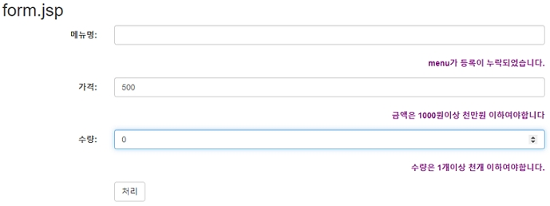

# Form 값의 검증, 에러 메세지 출력

## Form 값의 검증, 에러 메세지 출력

### 1. Controller class 추가

> CalcController.java

```java
package com.example.validator;

import java.util.HashMap;
import java.util.Map;

import org.springframework.stereotype.Controller;
import org.springframework.ui.Model;
import org.springframework.validation.BindingResult;
import org.springframework.web.bind.annotation.GetMapping;
import org.springframework.web.bind.annotation.PostMapping;

@Controller
public class CalcController {
  public CalcController() {
    System.out.println("--> CalcController created.");
  }

  // http://localhost:8000/calc
  @GetMapping("/calc2")
  public String calc() {
    return "/calc/form2";

  }

  // 에러가 발생했을때 자동으로 이전 폼으로 이동
  @PostMapping("/calc2")
  public String calc(CalcVO calcVO,
  BindingResult result,
  Model model) {

    CalcValidator calcValidator = new CalcValidator();
    calcValidator.validate(calcVO, result);  // 검증
    Map<String,String> errors = new HashMap<String,String>();

    if (result.hasErrors()) { // 에러 발생시
      if (result.getFieldError("menu") != null) { // 구체적인 필드별 에러 확인
        // errors.rejectValue("menu", "값 누락 error"); 의 메시지 출력됨.
        System.out.println("menu: " + result.getFieldError("menu").getCode());
        errors.put("menu","menu가 등록이 누락되었습니다.");
      }

      if (result.getFieldError("price") != null) {
        System.out.println("price: " + result.getFieldError("price").getCode());
        errors.put("price","금액은 1000원이상 천만원 이하여야합니다");

      }

      if (result.getFieldError("count") != null) {
        System.out.println("count: " + result.getFieldError("count").getCode());
        errors.put("count","수량은 1개이상 천개 이하여야합니다.");

      }

      model.addAllAttributes(errors);
      return "/calc/form2";
    } else { // 에러 미발생
      int payment = calcVO.getPrice() * calcVO.getCount();
      model.addAttribute("payment", payment);
      return "/calc/proc";
    가
  }
}
```

<br />

### 2. View 페이지 작성

> views/calc/form2.jsp

```jsp
<%@ page language="java" contentType="text/html; charset=UTF-8"
	pageEncoding="UTF-8"%>
<!DOCTYPE html>
<html>
<head>
<meta charset="UTF-8">
<title>Insert title here</title>
<meta name="viewport" content="width=device-width, initial-scale=1">
<link rel="stylesheet"
	href="https://maxcdn.bootstrapcdn.com/bootstrap/3.4.1/css/bootstrap.min.css">
<script
	src="https://ajax.googleapis.com/ajax/libs/jquery/3.5.1/jquery.min.js"></script>
<script
	src="https://maxcdn.bootstrapcdn.com/bootstrap/3.4.1/js/bootstrap.min.js"></script>
<script src="/js/incheck.js" defer></script>
</head>
<body>
	<div class="container">
		<h2>form2.jsp</h2>
		<form class="form-horizontal" method="post" action="./calc2"
			onsubmit="return check(this)">
			<div class="form-group">
				<label class="control-label col-sm-2" for="menu">메뉴명:</label>
				<div class="col-sm-8">
					<input type="text" class="form-control" autofocus="autofocus"
						id="menu" value="김밥" name="menu">
				</div>
			</div>
			<div class="form-group">
				<label class="control-label col-sm-10" style="color: purple;">${menu}</label>
			</div>
			<div class="form-group">
				<label class="control-label col-sm-2" for="price">가격:</label>
				<div class="col-sm-8">
					<input type="number" class="form-control" id="price" name="price"
						value="3000">
				</div>
			</div>
			<div class="form-group">
				<label class="control-label col-sm-10" style="color: purple;">${price}</label>
			</div>
			<div class="form-group">
				<label class="control-label col-sm-2" for="count">수량:</label>
				<div class="col-sm-8">
					<input type="number" class="form-control" id="count" name="count"
						value="2">
				</div>
			</div>
			<div class="form-group">
				<label class="control-label col-sm-10" style="color: purple;">${count}</label>
			</div>
			<div class="form-group">
				<div class="col-sm-offset-2 col-sm-10">
					<button type="submit" class="btn btn-default">처리</button>
				</div>
			</div>
		</form>
	</div>
</body>
</html>
```

<br />

### 3. 실행 결과

- 비 정상적 경우 form으로 이동후 오류메세지 출력한다.


