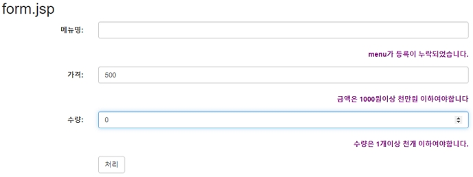

# Form 값의 검증, Annotation을 이용한 검증

## Form 값의 검증, Annotation을 이용한 검증

- VO class 필드에 validation Annotation 등록한다.

### 1. VO Class

> com.example.validator/CalcVOAnnotation.java

```java
package com.example.validator;

import javax.validation.constraints.Max;
import javax.validation.constraints.Min;
import javax.validation.constraints.NotEmpty;
import javax.validation.constraints.Size;

public class CalcVOAnnotation {
  // 우선순위: @NotEmpty -> @Size
  @NotEmpty(message = "메뉴명은 필수 입력입니다(Not empty).")
  @Size(min = 2, max = 30, message = "메뉴명은 2자이상 30자 미만입니다.")
  private String menu;
  @Max(value = 1000000, message = "금액은 100만원 이하여야 합니다.")
  @Min(value = 1000, message = "금액은 1000원 이상이어야 합니다.")
  private int price;
  @Max(value = 100, message = "수량은 100개 이하여야 합니다.")
  @Min(value = 1, message = "수량은 1개 이상이어야 합니다.")
  private int count;
  private int payment;

  public String getMenu() {
    return menu;
  }

  public void setMenu(String menu) {
    this.menu = menu;
  }

  public int getPrice() {
    return price;
  }

  public void setPrice(int price) {
    this.price = price;
  }

  public int getCount() {
    return count;
  }

  public void setCount(int count) {
    this.count = count;
  }

  public int getPayment() {
    return payment;
  }

  public void setPayment(int payment) {
    this.payment = payment;
  }
}
```

<br />

### 2. Validatator class

- 사용하지 않음

<br />

### 3. Controller class

> com.example.validator/CalcController3.java

```java
package com.example.validator;

import java.util.HashMap;
import java.util.Map;

import javax.validation.Valid;

import org.springframework.stereotype.Controller;
import org.springframework.ui.Model;
import org.springframework.validation.BindingResult;
import org.springframework.web.bind.annotation.GetMapping;
import org.springframework.web.bind.annotation.PostMapping;

@Controller
public class CalcController {

  public CalcController() {
    System.out.println(">>> CalcController created.");
  }

  @GetMapping("/calc3")
  public String calc3() {
    return "/calc/form3";
  }

  @PostMapping("/calc3")
  public String calc3(@Valid CalcVOAnnotation calcVO, BindingResult result, Model model) {

    Map<String, String> map = new HashMap<String, String>(); // 에러 메세지 저장

    if (result.hasErrors()) { // 에러 발생시
      if (result.getFieldError("menu") != null) {
        map.put("menu", "menu 등록이 누락되었습니다.");
      }
      if (result.getFieldError("price") != null) {
        map.put("price", result.getFieldError().getDefaultMessage());
      }
      if (result.getFieldError("count") != null) {
        map.put("count", "수량은 1개이상 천개 이하여야합니다.");
      }
      return "/calc/form2"; // 폼으로 리턴
    } else { // 에러 미발생시
      int payment = calcVO.getPrice() * calcVO.getCount();
      model.addAttribute("payment", payment);
      return "/calc/proc";
    }
  }
}
```

<br />

### 4. View 페이지

> views/calc/form3.jsp

```jsp
<%@ page language="java" contentType="text/html; charset=UTF-8"
	pageEncoding="UTF-8"%>
<!DOCTYPE html>
<html>
<head>
<meta charset="UTF-8">
<title>Insert title here</title>
<meta name="viewport" content="width=device-width, initial-scale=1">
<link rel="stylesheet"
	href="https://maxcdn.bootstrapcdn.com/bootstrap/3.4.1/css/bootstrap.min.css">
<script
	src="https://ajax.googleapis.com/ajax/libs/jquery/3.5.1/jquery.min.js"></script>
<script
	src="https://maxcdn.bootstrapcdn.com/bootstrap/3.4.1/js/bootstrap.min.js"></script>
<script src="/js/incheck.js" defer></script>
</head>
<body>
	<div class="container">
		<h2>form3.jsp</h2>
		<form class="form-horizontal" method="post" action="./calc3"
			onsubmit="return check(this)">
			<div class="form-group">
				<label class="control-label col-sm-2" for="menu">메뉴명:</label>
				<div class="col-sm-8">
					<input type="text" class="form-control" autofocus="autofocus"
						id="menu" value="김밥" name="menu">
				</div>
			</div>
			<div class="form-group">
				<label class="control-label col-sm-10" style="color: purple;">${menu}</label>
			</div>
			<div class="form-group">
				<label class="control-label col-sm-2" for="price">가격:</label>
				<div class="col-sm-8">
					<input type="number" class="form-control" id="price" name="price"
						value="3000">
				</div>
			</div>
			<div class="form-group">
				<label class="control-label col-sm-10" style="color: purple;">${price}</label>
			</div>
			<div class="form-group">
				<label class="control-label col-sm-2" for="count">수량:</label>
				<div class="col-sm-8">
					<input type="number" class="form-control" id="count" name="count"
						value="2">
				</div>
			</div>
			<div class="form-group">
				<label class="control-label col-sm-10" style="color: purple;">${count}</label>
			</div>
			<div class="form-group">
				<div class="col-sm-offset-2 col-sm-10">
					<button type="submit" class="btn btn-default">처리</button>
				</div>
			</div>
		</form>
	</div>
</body>
</html>
```

<br />

### 5. 실행결과

- 비정상적인 경우 form으로 이동후 오류메세지 출력한다.


