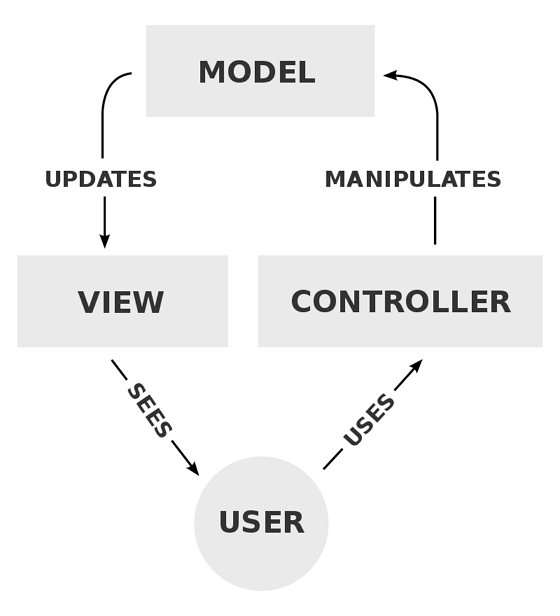
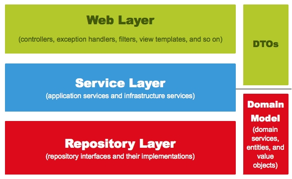
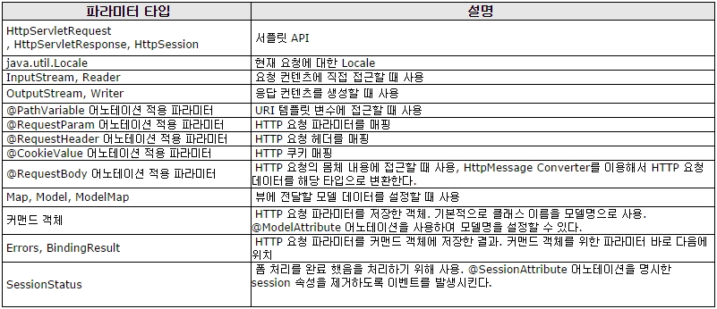
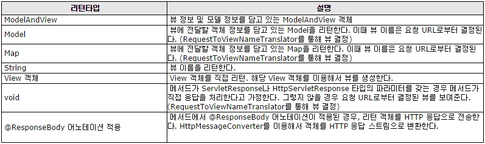

# Spring MVC ,Spring 웹 계층, Spring MVC 어노테이션

## 스프링 MVC의 주요 구성 요소

### 1. MVC 패턴의 구조는 Model, View, Controller 세 가지로 나누어진다.

- 모델은 비즈니스 로직과 DB 등에 대한 처리를 수행한다.
- 컨트롤러는 뷰와 모델을 이어주는 역할을 맡는다.
- 뷰의 요청에 따라 모델의 상태를 바꾸고, 이를 다시 뷰에 전달한다.
- 뷰는 사용자에게 보이는 영역이다. 컨트롤러를 통해 모델에 질의를 보내고, 그 값을 사용자에게 적절하게 보여준다.



<br />

## Spring 웹 계층

### 1. 스프링에는 5가지 요소가 존재한다.



<br />

#### (1) Web Layer

- `컨트롤러(@Controller)`와 `JSP등의 뷰 영역`이다.
- 이외에도 필터(@filter), 인터셉터, 컨트롤러 어드바이스 등 외부 요청과 응답에 대한 전반적인 영역을 의미한다.

#### (2) Service Layer

- `서비스 영역(@Service)`이다.
- 일반적으로 컨트롤러와 저장소(Repository, Dao)의 중간에 위치한다.
- `트랜잭션(@Transactional)`이 사용되어야 하는 영역이다.

#### (3) Repository Layer

- `DB`와 같은 데이터 `저장소에 접근하는 영역`이다.
- `DAO(Data Access Object)영역`이다.

#### (4) DTOs

- `DTO(Data Transfer Object)`는 `계층 간의 데이터 교환을 위한 객체`이며, 이들의 영역이다.

#### (5) Domain model

- 개발 대상, 즉 도메인을 모든 사람이 동일한 관점에서 이해할 수 있고 공유할 수 있도록 단순화한 것을 `도메인 모델`이라고 한다.
- JPA를 사용한다면, `@Entity가 사용되는 영역` 역시 도메인 모델이라 할 수 있다.

<br />

## Annotation

### 1. Spring MVC 어노테이션

- `@Controller`: 클래스 타입에만 적용되며,웹 요청처리에 사용
- `@RequestMapping`: 컨트롤러가 처리할 Get/Post방식 요청URL을 명시(클래스,메소드)
- `@GetMapping`: 컨트롤러가 처리할 Get방식 요청URL을 명시(메소드)
- `@PostMapping`: 컨트롤러가 처리할 POST방식 요청URL을 명시(메소드)

#### (1) 컨트롤러 메소드의 매개변수(파라메터) 타입



- `@RequestBody`: JSON데이터를 서버에 보내서 원하는 타입의 객체로 변환하는 용도로 사용

#### (2) 컨트롤러 메소드의 리턴값 타입



- `@ResponseBody`: JSP와 같은 뷰가 전달되는 것이 아니라 데이터 자체를 전달하기 위한 용도(Ajax 응답데이터)로 사용된다.

<br />

### 2. 그외 어노테이션

- `@PathVariable`: Parameter를 URL형식으로 받기
- `@RequestParam`: Form페이지에서 넘어오는 파라메터를 받을 수 있다.
- 해당 파라미터가 없다면 HTTP 400 - Bad Request 가 전달 된다.

```
public String edit( @RequestParam("id") int id,
    @RequestParam("title") String title,
    @RequestParam("file") MultipartFile file ) {...}
```

- 파라미터가 필수가 아니라면 required = false 로 지정하면 된다.
- 파라미터가 없으면 NULL이 들어간다.
- default 값을 지정 할 수도 있다.

```
public void view( @RequestParam(value = "id",
    required = false,
    defaultValue = "0" ) int id) {..}.
```

- `@RequestParam`을 생략하여 사용할수 있다.
- Map타입으로 데이터를 받을경우는 반드시 `@RequestParam`을 명시해야 데이터를 받아온다.

```
<input type="text" name="id" /><br>
<input type="password" name="passwd" />

public String add( @RequestParam Map<String, String> params ) {...}
```

- `@ModelAttribute`: 파라미터를 Object(DTO) 형태로 받을때 사용

```
ex) public void update( @ModelAttribute("board") Board board) {...}
```

- `@SessionAttributes`: 세션상에서 model의 정보를 유지하고 싶을 경우 사용
- `@RequestBody`: JSON 데이터를 원하는 타입으로 바인딩 처리
