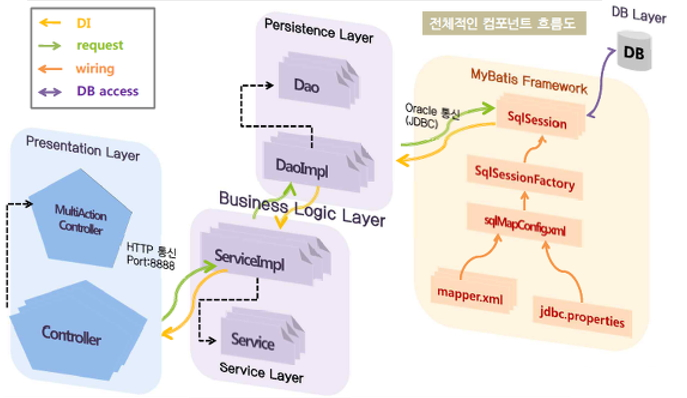
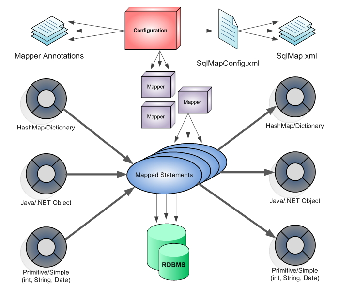

# Mybatis 프레임워크 특징

## Mybatis 프레임워크

- 아파치(Apache) 소프트웨어 재단의 IBatis 개발자팀이 구글 코드로 이전하고, 구글 코드에서는 이름이 MyBatis로 변경되었다.

### 1. Mybatis 프레임 특징

- 한두줄의 자바코드로 DB연동을 처리한다. 코드길이가 줄어들었다.
- SQL 명령어를 자바코드에서 분리하여 XML 파일에 따로 관리한다.
- 이식성이 좋아 어떤 프로그래밍 언어로도 구현 가능
- 오픈소스이며 무료임

#### (1) Mybatis Component Flow

- Mybatis Framework가 Business Layer(Persistance Layer + Service Layer)와 DB Layer사이 가운데서 양쪽을 연결하고 있다.
- 하단의 mapper.xml 파일을 이용하여 쿼리문을 별도로 작성한다.

 

### 2. Mybatis의 구성요소

#### (1) Configuration 파일(SqlMapConfig.xml)

- Mybatis 메인 환경설정를 정의 한다.
- DB설정및 mapper 설정등을 한다.
- DB 설정은 별도의 properties 파일로 분리할 수 있다.
- mapper는 SQL query를 xml문서로 분리한 것이다.

#### (2) 매퍼(Mapper)

- 두가지 종류의 매퍼를 정의 할 수 있다.
- 첫째는 SQL을 XML에 정의된 XML파일로 생성
- 두번째는 SQL을 메소드에 어노테이션으로 정의한 인터페이스로 생성

#### (3) 매핑구문(Mapped Statements)

- SQL을 DB에 실행할 구문을 의미한다.
- 매핑 구문은 어노테이션 정의 방법과 XML정의 방식 두가지가 있다.

#### (4) Mybatis Java API

- SqlSession 는 Mapper xml에 등록된 SQL구분을 실행한다.
- SqlSession 객체는 SQL구분을 실행하기 위한 여러가지 메소드를 제공한다.
- selectOne(), selectList(), insert(), update(), delete() 등

