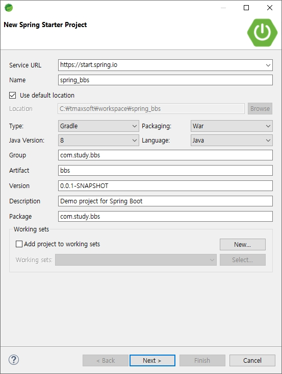
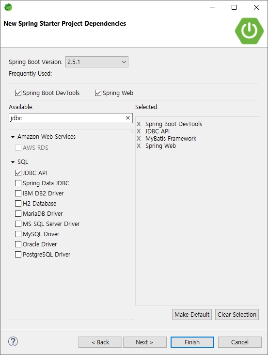

# bbs, Spring Boot Starter Project 생성, application, MyBatis 설정

## Spring Boot bbs 만들기

### 1. Spring Starter Project 실행



- mysql 사용시 드라이버 선택



<br />

### 2. build.gradle, application.properties 설정

- jsp 사용을 위한 의존성 추가
- Annotation기반 Form검증 validation 의존성 추가
- Gradle -> Refresh Gradle Project

> build.gradle 편집

```
implementation 'javax.servlet:jstl'
implementation 'org.apache.tomcat.embed:tomcat-embed-jasper'
implementation 'org.springframework.boot:spring-boot-starter-validation'
```

- 서버포트 변경
- JSP view path
- oracle/mysql 설정, Conntion pool 설정

> application.properties

```
server.port = 8000
# JSP View path
spring.mvc.view.prefix=/WEB-INF/views/
spring.mvc.view.suffix=.jsp
# DEVTOOLS (DevToolsProperties)
spring.devtools.livereload.enabled=true
#mysql
spring.datasource.hikari.driver-class-name=com.mysql.cj.jdbc.Driver
spring.datasource.hikari.jdbc-url: jdbc:mysql://127.0.0.1:3306/webtest?useUnicode=true&characterEncoding=utf8
spring.datasource.hikari.username=javauser
spring.datasource.hikari.password=1234
# All DBMS
spring.datasource.hikari.maximum-pool-size=10
spring.datasource.hikari.minimum-idle=5
spring.datasource.hikari.connection-timeout=5000
```

<br />

### 3. Component scan 패키지 설정

> SpringBbsApplication.java

```java
package com.study.bbs;

import org.springframework.boot.SpringApplication;
import org.springframework.boot.autoconfigure.SpringBootApplication;
import org.springframework.context.annotation.ComponentScan;

@SpringBootApplication
@ComponentScan(basePackages = { "com.study.*" })
public class SpringBbsApplication {

  public static void main(String[] args) {
    SpringApplication.run(SpringBbsApplication.class, args);
  }
}
```

<br />

### 4. JSP Views, images 폴더 생성

#### (1) jsp views

- /src/main/폴더에 webapp/WEB-INF/views 생성

<br />

#### (2) images

- /src/main/resources/static 폴더에 images 생성

<br />

### 5. Mybatis 설정

#### (1) DatabaseConfiguration 클래스 생성

- @PropertySource("classpath:/application.properties")는 이 클래스에서 application.properties를 사용
- Hikari를 사용한 datasource를 생성하기 위한 메소드 선언
- 설정 파일의 접두사 선언 spring.datasource.hikari....
- spring mybatis에서 필요한 SqlSessionFactory와 SqlSessionTemplate를 생성 하기 위한 메소드 선언
- /src/main/resources/mybatis 폴더의 파일명이 "xml"로 끝나는 파일 매핑
- MapperScan의 basePackages 선언

> DatabaseConfiguration.java

```java
package com.study.bbs;

import javax.sql.DataSource;

import org.apache.ibatis.session.SqlSessionFactory;
import org.mybatis.spring.SqlSessionFactoryBean;
import org.mybatis.spring.SqlSessionTemplate;
import org.mybatis.spring.annotation.MapperScan;
import org.springframework.beans.factory.annotation.Autowired;
import org.springframework.boot.context.properties.ConfigurationProperties;
import org.springframework.context.ApplicationContext;
import org.springframework.context.annotation.Bean;
import org.springframework.context.annotation.Configuration;
import org.springframework.context.annotation.PropertySource;

import com.zaxxer.hikari.HikariConfig;
import com.zaxxer.hikari.HikariDataSource;

@Configuration
@PropertySource("classpath:/application.properties") // 설정 파일 위치
@MapperScan(basePackages = { "com.study.model" })
public class DatabaseConfiguration {
  @Autowired
  private ApplicationContext applicationContext;

  @Bean
  @ConfigurationProperties(prefix = "spring.datasource.hikari") // 설정 파일의 접두사 선언
  public HikariConfig hikariConfig() {
    return new HikariConfig();
  }

  @Bean
  public DataSource dataSource() throws Exception {
    DataSource dataSource = new HikariDataSource(hikariConfig());
    System.out.println(dataSource.toString()); // 정상적으로 연결 되었는지 해시코드로 확인
    return dataSource;
  }

  @Bean
  public SqlSessionFactory sqlSessionFactory(DataSource dataSource) throws Exception {
    SqlSessionFactoryBean sqlSessionFactoryBean = new SqlSessionFactoryBean();
    sqlSessionFactoryBean.setDataSource(dataSource);
    sqlSessionFactoryBean.setMapperLocations(applicationContext.getResources("classpath:/mybatis/**/*.xml"));
    return sqlSessionFactoryBean.getObject();
  }

  @Bean
  public SqlSessionTemplate sqlSessionTemplate(SqlSessionFactory sqlSessionFactory) {
    return new SqlSessionTemplate(sqlSessionFactory);
  }
}
```

<br />

#### (2) mysql 설정 JUnit 테스트

- /src/main/resources/mybatis 폴더 생성
- /src/test/java 폴더에 테스트 기초 파일이 생성되어 있음
- SqlSessionTemplate 객체 값 확인을 위해서 아래내용 작성
- 테스트 실행: SpringBbsApplicationTests.java 파일 선택 -> Debug as -> JUnit test

> SpringBbsApplicationTests.java

```java
package com.study.bbs;

import org.junit.jupiter.api.Test;
import org.mybatis.spring.SqlSessionTemplate;
import org.springframework.beans.factory.annotation.Autowired;
import org.springframework.boot.test.context.SpringBootTest;

@SpringBootTest
class SpringBbsApplicationTests {
  @Autowired
  private SqlSessionTemplate sqlSession;

  @Test
  void contextLoads() {
  }

  @Test
  public void testSqlSession() throws Exception {
    System.out.println(sqlSession.toString());
  }
}
```

- 결과

```
--------------------------------------------------
. \_**\_ \_ ** \_ \_
/\\ / **_'_ ** \_ _(_)_ \_\_ \_\_ _ \ \ \ \
( ( )\_** | '_ | '_| | '_ \/ _` | \ \ \ \
 \\/ \_**)| |_)| | | | | || (_| | ) ) ) )
' |\_**\_| .**|_| |_|_| |_\__, | / / / /
=========|_|==============|_\_\_/=/_/_/_/
:: Spring Boot :: (v2.4.3)
--------------------------------------------------
HikariDataSource (HikariPool-1)
--------------------------------------------------
org.mybatis.spring.SqlSessionTemplate@2dd3d39d
```
