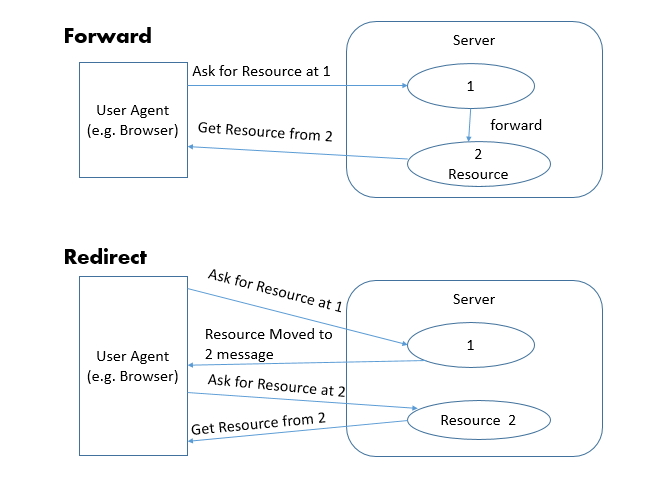
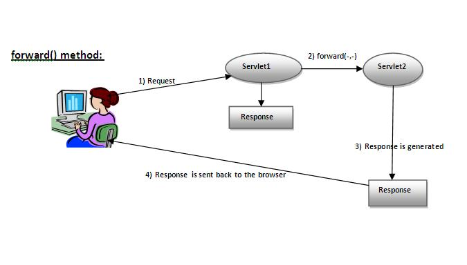

# request JSP 내부 객체

## request JSP 내부 객체

### 1. request 객체에 객제 저장

- mvc_test 프로젝트에서 작업
- request 폴더를 만들어 준다.

<br />

### 2. 다른 페이지 요청



(1) <jsp:`forward` page="" />

- 기존 요청에 `대신 응답`으로 다른페이지로 이동합니다.
- 기존의 request객체가 살아있으므로 그영역의 **저장된 모든 데이터는 유지**됩니다.



(2) response.sendRedirect( );

- 재 요청에 대한 응답으로 다른 페이지로 이동합니다.
- 새로운 request객체가 생성되므로 기존 request영역에 **저장된 모든 데이터가 없어**집니다.

(3) <jsp:include page=""/>

- 다른 자원을 요청 페이지에 포함 시킵니다.


> request.PageInfo.java

```java
package request;

public class PageInfo {
	private int nowPage;
	private String searchColumn = "";
	private String searchWord = "";

	public PageInfo() {
		super();
		// TODO Auto-generated constructor stub
	}

	public PageInfo(int nowPage, String searchColumn, String searchWord) {
		super();
		this.nowPage = nowPage;
		this.searchColumn = searchColumn;
		this.searchWord = searchWord;
	}

	@Override
	public String toString() {
		return "PageInfo [nowPage=" + nowPage + ", searchColumn=" + searchColumn + ", searchWord=" + searchWord + "]";
	}

	public int getNowPage() {
		return nowPage;
	}

	public void setNowPage(int nowPage) {
		this.nowPage = nowPage;
	}

	public String getSearchColumn() {
		return searchColumn;
	}

	public void setSearchColumn(String searchColumn) {
		this.searchColumn = searchColumn;
	}

	public String getSearchWord() {
		return searchWord;
	}

	public void setSearchWord(String searchWord) {
		this.searchWord = searchWord;
	}
}
```

> Webapp/request/pageinfo.jsp

```jsp
<%@ page language="java" contentType="text/html; charset=UTF-8"
    import="request.*"%>
<%
	PageInfo info = new PageInfo();
	info.setNowPage(1);
	info.setSearchColumn("title");
	info.setSearchWord("JSP");

	request.setAttribute("info", info); // 2. 기존에 저장된 인포

	//response.sendRedirect("pageinfo2.jsp"); -> 1.리퀘스트는 사라진다. 새로운 리퀘스트 재 요청
%>
<jsp:forward page="./pageinfo2.jsp" />
<!DOCTYPE html>
<html>
<head>
<meta charset="UTF-8">
<title>Insert title here</title>
</head>
<body>

</body>
</html>
```

> webapp/request/pageinfo2.jsp

```jsp
<%@ page language="java" contentType="text/html; charset=UTF-8"
    import="request.*"%>
<%
	PageInfo info = (PageInfo)request.getAttribute("info"); // 3. 새로운 저장하지 않은 인포(2번과 다른 인포)
%>
<!DOCTYPE html>
<html>
<head>
<meta charset="UTF-8">
<title>Insert title here</title>
</head>
<body>
	<div  style="font-size:xx-large; text-align:center">
		<h2>pageinfo2.jsp</h2>
        <!-- 4. 리퀘스트는 기존에 연결되어있어서 get으로 불러옴 -->
		nowPage : <%=info.getNowPage() %> <br />
		searchColumn : <%=info.getSearchColumn() %> <br />
		searchWord : <%=info.getSearchWord() %> <br />
	</div>
</body>
</html>
```
