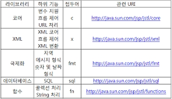

# JSTL(JSP Standard TAG Library)의 사용1

## JSTL(JSP Standard TAG Library)의 사용

- 많이 사용되는 사용자 정의 태그를 모아서 JSTL 규약 생성
- 스크립틀릿, 표현식을 보다 훨씬 간결한 문법 구조 지원
- JSTL은 5가지의 태그를 지원
- jstl API (http://java.sun.com/products/jsp/jstl/1.1/docs/tlddocs/index.html)



<br />

```
라이브러리     기능                        접두어      관련 URL
---------------------------------------------------------------------------------------
Core          변수지원,흐름제어,URL      c      http://java.sun.com/jsp/jstl/core ★
함수           콜렉션 처리, String          fn     http://java.sun.com/jsp/jstl/functions ★
```

### 1. Spring 컨테이너는 관련 모듈을 제공한다.

#### (1) Core Tag

```

기능       태그명        기능설명
---------------------------------------------------------------------------
변수 지원   set           jsp에서 사용될 변수를 설정
               remove     설정한 변수를 제거
---------------------------------------------------------------------------
흐름 제어   if            조건에 따라 내부 코드를 수행.
               choose     다중 조건을 처리할 때 사용
               forEach     Collection의 각 항목을 처리할 때 사용
               forTokens  구분자로 분리된 각각의 토큰을 처리할 때 사용
---------------------------------------------------------------------------
URL 처리   import      URL을 사용하여 다른 자원의 결과를 삽입
               redirect     지정한 경로로 이동
               url           URL을 재 작성
---------------------------------------------------------------------------
기타 태그   catch       예외 처리에 사용
               out           jspWriter에 내용을 알맞게 처리한 후 출력
---------------------------------------------------------------------------
```

<br />

### 2. EL & JSTL의 사용 - Core Tag

#### (1) 변수지원 태그, http://127.0.0.1:8000/jstl/setTag.jsp

> jstl/setTag.jsp

```jsp
<%@ page contentType = "text/html; charset=UTF-8" %>
<%@ taglib prefix="c" uri="http://java.sun.com/jsp/jstl/core" %>
<c:set var="num1" value="${20}" />
<c:set var="num2">
10.5
</c:set>
<c:set var="today" value="<%= new java.util.Date() %>" />
<html>
<head>
    <title>set 태그와 remove 태그</title>
</head>
<body>
변수 num1 = ${num1} <br>
변수 num2 = ${num2} <br>
num1 + num2 = ${num1 + num2} <br>
오늘은 ${today} 입니다.
<c:remove var="num1" scope="page" />

<p>
삭제한 후의 num1 = ${num1} <br>
삭제한 후의 num1 + num2 = ${num1 + num2}
</body>
</html>
```

<br />

#### (2) Map 객체의 사용, http://127.0.0.1:8000/jstl/setTag2.jsp

> jstl/setTag2.jsp

```jsp
<%@ page contentType = "text/html; charset=UTF-8" %>
<%@ taglib prefix="c" uri="http://java.sun.com/jsp/jstl/core" %>
<c:set var="map" value="<%= new java.util.HashMap() %>" />

<html>
<head>
    <title>set 태그와 remove 태그</title>
</head>
<body>
<c:set target="${map}" property="name" value="왕눈이" />
<c:set target="${map}" property="aromi" value="아로미" />
<h2>
변수 map에 저장된 name 값: ${map.name}<br>
변수 map에 저장된 aromi값: ${map.aromi}

</body>
</html>
```

<br />

### 3. EL & JSTL의 사용 - Core Tag

- 흐름 제어 태그의 사용

#### (1) if 흐름제어 태그의 사용

- http://127.0.0.1:8000/jstl/ifTag.jsp
- http://127.0.0.1:8000/jstl/ifTag.jsp?name=tree
- http://127.0.0.1:8000/jstl/ifTag.jsp?name=tree&age=25
- 한글은 비교가 안된다.

> jstl/ifTag.jsp

```jsp
<%@ page contentType = "text/html; charset=UTF-8" %>
<%@ taglib prefix="c" uri="http://java.sun.com/jsp/jstl/core" %>

<html>
<head><title>if 태그</title></head>
<body>
<c:if test="true">
무조건 수행<br>
</c:if>

<c:if test="${param.name == 'tree'}">
name 파라미터의 값이 ${param.name} 입니다.<br>
</c:if>

<c:if test="${18 < param.age}">
당신의 나이는 18세 이상입니다.
</c:if>

</body>
</html>
```

<br />

#### (2) choose Tag

- when tag는 조건이 true이면 실행합니다.
- http://127.0.0.1:8000/jstl/chooseTag.jsp
- http://127.0.0.1:8000/jstl/chooseTag.jsp?name=tree
- http://127.0.0.1:8000/jstl/chooseTag.jsp?age=25

> jstl/chooseTag.jsp

```jsp
<%@ page contentType = "text/html; charset=UTF-8" %>
<%@ taglib prefix="c" uri="http://java.sun.com/jsp/jstl/core" %>

<html>
<head><title>choose 태그</title></head>
<body>

<ul>
<c:choose>
  <c:when test="${param.name == 'tree'}" >
    <li> 당신의 이름은 ${param.name} 입니다.
  </c:when>
  <c:when test="${param.age > 18}" >
    <li> 당신은 18세 이상입니다.
  </c:when>
  <c:otherwise>
    <li> 당신은 tree가 아니고 18세 이상도 아닙니다.
  </c:otherwise>
</c:choose>
</ul>

</body>
</html>
```

<br />

#### (3) forEach 태그

- Collection, Map에 저장되어 있는 값에 순차적으로 접근시에 사용
- http://127.0.0.1:8000/jstl/forEachTag.jsp

> /jstl/forEachTag.jsp

```jsp
<%@ page contentType = "text/html; charset=UTF-8" %>
<%@ taglib prefix="c" uri="http://java.sun.com/jsp/jstl/core" %>
<%

    java.util.HashMap mapData = new java.util.HashMap();
    mapData.put("name", "아로미");
    mapData.put("today", new java.util.Date());

%>
<c:set var="intArray" value="<%= new int[] {1,2,3,4,5} %>" />
<c:set var="map" value="<%= mapData %>" />

<html>
<head><title>forEach 태그</title></head>
<body>
<h4>1부터 100까지 홀수의 합</h4>
<c:forEach var="i" begin="1" end="100" step="2">
<c:set var="sum" value="${sum + i}" />
</c:forEach>
결과 = ${sum}

<h4>구구단: 4단</h4>
<ul>
<c:forEach var="i" begin="1" end="9">
   <li>4 * ${i} = ${4 * i}
</c:forEach>
</ul>

<h4>int형 배열</h4>

<c:forEach var="i" items="${intArray}" begin="2" end="4">
    [${i}]
</c:forEach>

<h4>Map</h4>

<c:forEach var="i" items="${map}">
${i.key} = ${i.value}<br>
</c:forEach>

</body>
</html>
```

<br />

#### (4) forTokens Tag

> jstl/forTokensTag.jsp

```jsp
<%@ page contentType = "text/html; charset=UTF-8" %>
<%@ taglib prefix="c" uri="http://java.sun.com/jsp/jstl/core" %>

<html>
<head><title>forTokens 태그</title></head>
<body>

콤마와 점을 구분자로 사용:<br>
<c:forTokens var="token"
items="빨강색,주황색.노란색.초록색,파랑색,남색.보라색"
delims=",.">
${token}
</c:forTokens>

</body>
</html>
```
