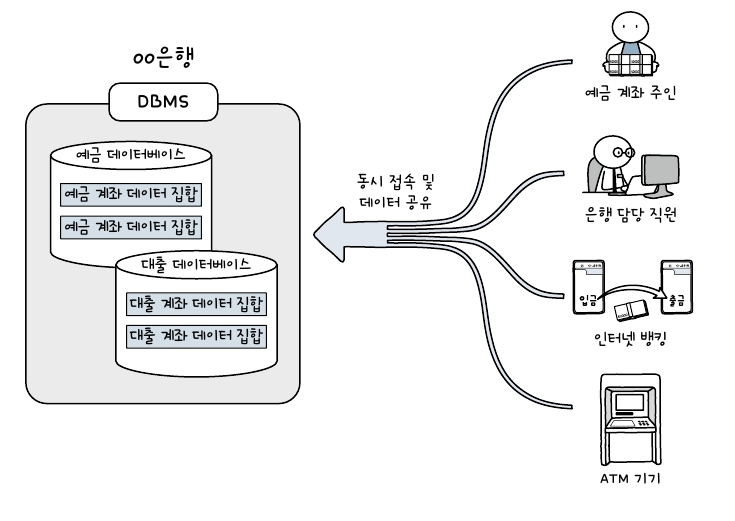
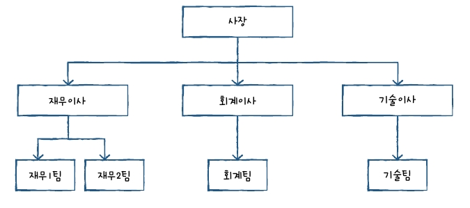
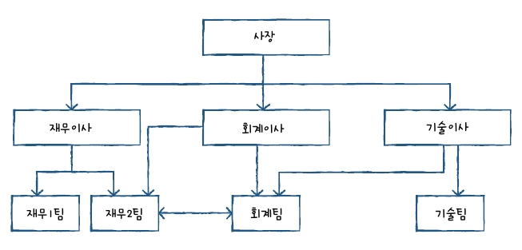
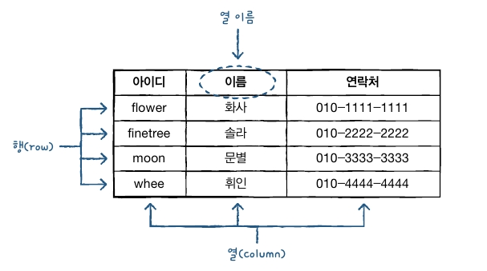

# 데이터 베이스와 DBMS

## 데이터베이스와 DBMS

- 데이터베이스는 `데이터의 집합`이다. 우리 일상생활 대부분의 정보가 저장되고 관리된다.
- `데이터 베이스를 관리하고 운영하는 소프트웨어`를 `DBMS`(Database Management System) 라 한다.
- 다양한 데이터가 저장되어 있는 데이터베이스는 여러명의 사용자나 응용 프로그램과 공유하고 동시에 접근이 가능하다.
- 마이크로소프트 사의 엑셀은 대용량 데이터를 관리하거나 여러 사용자와 공유하는 개념이 없어 DBMS라고 하지 않는다.

 

### 1. DBMS 종류

|    DBMS    |   제작사   |       작동 운영체제       | 최신 버전 | 기타                                                 |
| :--------: | :--------: | :-----------------------: | :-------: | ---------------------------------------------------- |
|   MySQL    |   Oracle   | Unix, Linux, Windoes, Mac |    8.0    | 오픈 소스(무료), 상용                                |
|   MriaDB   |   MriaDB   |   Unix, Linux, Windoes    |   10.6    | 오픈 소스(무료), MySQL 초기 개발자들이 독립해서 만듦 |
| PostgreSQL | PostgreSQL | Unix, Linux, Windoes, Mac |    12     | 오픈 소스(무료)                                      |
|   Oracle   |   Oracle   |   Unix, Linux, Windoes    |    18c    | 상용 시장 점유율 1위                                 |
| SQL Server | Microsoft  |          Windows          |   2019    | 주로 중/대형급 시장에서 사용                         |
|    Db2     |    IBM     |   Unix, Linux, Windoes    |    11     | 메인프레임 시장 점유율 1위                           |
|   Access   | Microsoft  |          Windows          |   2019    | PC용                                                 |
|   SQLite   |   SQLite   |       Android, IOS        |     3     | 모바일 전용, 오픈 소스(무료)                         |

 

### 2. DBMS 분류

- DBMS 유형은 계층형(Hierarchical), 망형(Network), 관계형(Relational), 객체지향형(Object-Oriented), 객체관계형(Object-Relational)등으로 분류된다.
- `관계형 DBMS가 가장 많은 부분을 차지`하며 MySQL도 관계형 DBMS에 포한된다.

 

#### (1) 계층형 DBMS(Hierarchical DBMS)

- 처음등장한 DBMS 개념, 1960년대에 시작, 트리 형태를 갖는다.
- 계층형 DBMS의 **문제는 처음 구성을 완료한 후에 이를 변경하기 까다롭다. 또 다른 구성원을 찾아 가는 것이 비효율적이다.**
- 재무2팀에서 회계팀으로 연결하려면 재무이사 -> 사장 -> 회계이사 -> 회계팀과 같이 여러단계를 거쳐야 한다.
- 지금은 사용하지 않는 형태이다.

 

#### (2) 망형 DBMS (Network DBMS)

- 계층형 DBMS의 문제점을 개선하기 위해 1970년대에 등장했다.
- 하위의 구성원끼리도 연결된 유연한 구조를 가진다.
- 재무2팀에서 바로 회계팀으로 연결이 가능하다.
- 망형 DBMS를 잘 활용하려면 **프로그래머가 모든 구조를 이해해야만 프로그램 작성이 가능한 단점**이 있다.
- 역시 지금은 사용하지 않는 형태이다.

 

#### (3) 관계형 DBMS( Relational DBMS : RDBMS)

- MySQL 뿐 아니라 대부분의 DBMS가 RDBMS 형태로 사용된다.
- RDBMS의 데이터베이스는 `테이블(table) 이라는 최소 단위로 구성`되며, 이 테이블은 하나 이상의 `열(column)과 행(row)`로 이루어져 있다.
- 워드나 엑셀의 표 모양의 2차원 구조를 테이블이다. 테이블의 형태는 아래와 같다.

 

### 3. SQL(Structured Query Language)

- `RDBMS에서 사용되는 언어`이다. '에스큐엘', '시퀄'로 읽는다.
- SQL은 특정 회사에서 만드는 것이 아니라 `국제표준화기구에서 SQL에 대한 표준을 정해서 발표`하고 있다. (표준 SQL)
- 표준 SQL을 준수하되, 각 제품을 반영한 SQL을 사용하므로 SQL 언어는 DBMS 제품마다 조금씩 다를 수 있다.

 

#### (1) SQL 언어의 종류

- ANSI SQL92, 99에 기준하여 각 데이터 베이스 상에서 SQL을 사용할 수 있습니다.
- `DQL`(Data Query Language), 데이터 질의어, **데이터 검색, 출력**과 관련된 쿼리  
  `. SELECT..FROM..WHERE`
- `DML`(Data Manapulation Language), 데이터 조작어, **데이터 입력, 수정, 삭제**와 관련된 쿼리  
  `. INSERT, UPDATE, DELETE`
- `DDL`(Data Definition Language), 데이터 정의어, **테이블 생성 및 삭제, 테이블 구조 수정**과 관련된 쿼리  
  `. CREATE TABLE, DROP TABLE, ALTER TABLE`
- `TCL`(Transaction Control Language), 트랜잭션 제어 언어, **안정적인 데이터 처리를 위한 데이터 처리**와 관련된 명령어  
  `. COMMIT, ROLLBACK, SAVEPOINT`
- `DCL`(Data Control Language)데이터 **제어 언어, 권한 부여**와 관련된 쿼리  
  `. GRANT, REVOKE`
