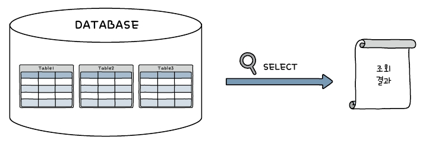

# DQL, 관계/논리 연산자, Between A and B, IN(), LIKE, 서브쿼리

## DQL (Data Query Language)

- SELECT ~ FROM ~ WHERE
- select 문은 `구축된 테이블에서 데이터를 추출` 한다.
- select 문은 `기존의 데이터가 변경되지 않는다`.
- where 다음에 조건식이 나온다. 조건에 맞는 데이터를 뽑아낼 때 사용한다.
- select 문은 데이터베이스의 테이블을 조회한 후 결과를 보여준다.



<br />

### 1. SELECT ~ FROM

```
Select 열_이름
    From 테이블_이름
    Where 조건식
    Group by 열_이름
    Having 조건식
    Order by 열_이름
    Limit 숫자
```

<br />

#### (1) USE 문

- select문을 실행하기 위해 먼저 사용할 데이터 베이스를 지정한다.

```
use database_이름;
use shop_db;
use market_db;
```

<br />

#### (2) select 문의 기본 형식

```
SELECT  열_이름
    FROM  테이블_이름
    WHERE  조건식;
```

- use문으로 market_db 선택, Select문으로 회원테이블 조회
- `select` : 데이터 가져올 때 사용하는 예약어
- `*` : 모든 것을 의미, 모든 열을 의미한다.
- `from` : 다음에 테이블 이름이 나온다.
- member : 조회할 테이블 이름

<br />

```
use market_db;
select * from member;
```

- member 테이블의 전체 내용을 가져온다.

```
select mem_name from member;
```

- mem_name(회원이름) 열만 가져온다.

```
select addr, debut_date, mem_name from member;
```

- `여러 개의 열을 가져오려면 (,)로 구분`한다.

```
select addr 주소, debut_date `데뷔 일자`, mem_name from member;
```

- 열이름에 별칭(alias)를 지정한다. 별칭에 공백은 (``)로 묶어준다.

<br />

- `특정한 조건을 조회`하기 위해 `select ~ from ~ where`으로 작성한다.
  - where 절은 조회하는 결과에 특정한 조건을 추가해서 원하는 데이터만 보고 싶을 때 사용한다.
  - where 절 열이름 = 값에 해당하는 결과를 출력해준다.

<br />

```
select * from member where mem_name = '블랙핑크';
```

- 이름 열은 문자형이므로 작은 따옴표로 묶어준다.

```
select * from member where mem_number = 4;
```

- 인원(mem_number)처럼 숫자형은 열을 조회할 때 작은 따옴표가 필요없다.

<br />

### 2. 관계연산자(>,<, >=,<=, =), 논리 연산자(OR, AND) 사용

- 숫자로 표현된 데이터는 범위를 지정할 수 있다.

```
select  mem_id, mem_name
    from  member
    where  height <= 162;
```

- 예를 들어 평균 키(height)가 162 이하인 회원을 검색하려면 `관계 연산자 <=( 작거나 같다)`를 사용한다.

```
select mem_id, mem_name, height
    from member
    where height <= 165
    and mem_number > 6;
```

- 평균키가 165 이상이면서 인원이 6명 이상인 회원은 **논리 연산자 AND**를 이용한다.

```
select mem_id, mem_name, height
    from member
    where height <= 165
    or mem_number > 6;
```

- 평균키가 165 이상이거나 인원이 6명 이상인 회원은 **논리 연산자 OR**를 이용한다.

<br />

### 3. BETWEEN ~AND

```
select  mem_name, height
    from member
    where height >= 163
    and height <= 165;
```

- AND를 사용해서 평균 키(height) 가 163 ~ 165인 회원 조회

```
select  mem_name, height
    from  member
    where  height  between 163 and 165;
```

- `범위값을 구할 경우` BETWEEN ~ AND를 사용해도 된다.

<br />

### 4. IN()

```
select mem_name, addr
    from  member
    where  addr = '경기' or addr = '전남' or addr = '경남';
```

- 주소중 경기/전남/경남 중 한 곳에 사는 회원을 검색하려면 OR을 일일이 써서 사용한다.

```
select  mem_name, addr
    from  member
    where  addr in ( '경기','전남' , '경남');
```

- IN()을 사용하면 `코드를 간결하게 작성`할 수 있다.

<br />

### 5. LIKE

- `특정 단어가 포함`되거나, `시작, 끝나는 데이터를 검색`할 때 사용한다.
- `여러 문자`를 매칭하기 위해서 `(%)` 를 사용한다.
- `한자`를 매칭하기 위해서 `(_)`를 사용한다.

```
select  *
  from  member
  where  mem_name like '우%';
```

- 우로 시작하는 어떠한 문자가 올 수 있다.

```
select  *
  from  member
  where  mem_name like '__핑크';
```

- 앞 두글자는 상관없고 뒤에 '핑크'인 회원을 검색

<br />

### 6. 서브쿼리

- **select 문 안에 또 다른 select이 들어있는 것을 서브쿼리라 한다.**

```
select  height
  from  member
  where  mem_name = '에이핑크';
```

- 이름이 '에이핑크' 인 회원의 평균 키( height)보다 큰 회원을 검색하고자 한다.
- 우선 에이핑크의 평균 키를 알아야 한다. 164

```
select  mem_name, height
  from  member
  where  height > 164;
```

- 이제는 164보다 평균 키(height)가 큰 회원을 조회한다.

```
select  mem_name, height
  from member
  where height > (select  height from  member where  mem_name = '에이핑크');
```

- 두 SQL을 하나로 만들기 위해 서브쿼리를 사용한다.
- 먼저 에이핑크 평균키를 구하는 쿼리를 서브쿼리로 만들고 그결과를 비교하는 쿼리를 주쿼리로 한다.

```
select mem_id
  from member
  where mem_name in (
    select mem_name
    from  member
    where  mem_number = 6
    and   addr = '경기'
  );
```

- 서브쿼리의 리턴결과가 두개 이상일때 in연산자 사용한다.
