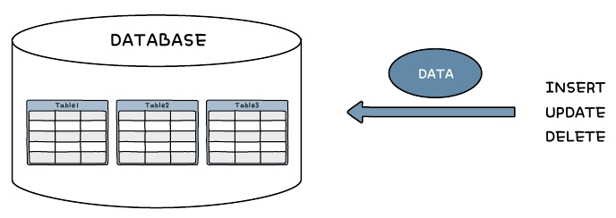
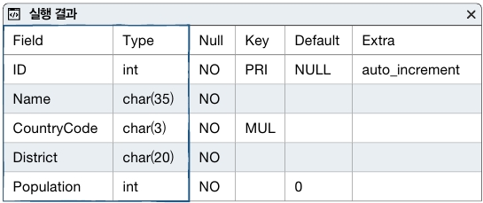
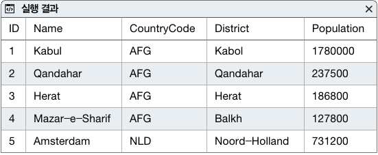

# DML(Data Manapulation Language), auto_increment

## DML(Data Manapulation Language)

- 데이터 조작어로 `입력, 수정, 삭제`하는 기능을 말한다.
- `입력시 insert`, `수정시 update`, `삭제시 delete`를 사용한다.



<br />

### 1. insert

- 기본적인 형식

```
INSERT INTO 테이블 [(열1, 열2, ......)] VALUES (값1, 값2, ......)
```

<br />

```
use market_db;
create table test(toy_id int, toy_name char(4), age int);
insert into test values ( 1, 'kim', 25);

select * from test;
```

- 테이블 이름 다음 열은 생략 가능하다. 생략 할 경우 values 다음에 나오는 값들의 순서 및 개수는 테이블을 정의할 때의 열 순서 및 개수와 동일해야 한다.

```
insert into test(toy_id, toy_name) values ( 1, 'hong');

select * from test;
```

- test 테이블에서 나이는 빼고 toy_id, toy_name만 입력하고 싶다면 입력하려는 열과 값을 써줘야 한다.

<br />

### 2. auto_increment

- 모든 테이블의 데이터는 `유일성을 보장`해야 한다.
- `자동`으로 `1`부터 `일련번호`를 만들어준다
- insert시 해당 열이 없다고 생각하고 입력한다.
- auto_increment지정 열은 `primary key`로 지정되야 하고 `int형`이어야 한다.
- primary key는 중복되지 않고 검색시 `빠른 검색을 해주는 인덱스가 적용된 컬럼`을 나타낸다.

```
create table test2(
    toy_id int not null auto_increment primary key,
    toy_name char(4),
    age int);

insert into test2 values(null, '보핍',25);
insert into test2 values(null, '슬링키',22);
insert into test2 values(null, '렉스',21);

insert into test2(toy_name,age) values('홍길동',32);

select * from test2;
```

```
select last_insert_id();
```

- 자동 증가로 증가된 값 확인하기

```
alter table test2 auto_increment = 100;
insert into test2(toy_name, age) values('lee',21);
insert into test2(toy_name, age) values('영희',23);
select * from test2;
```

- **자동 증가되는 값을 중간에 변경**하고 싶을때, `alter table 뒤에 auto_increment값을 변경`하면 된다.

<br />

### @@auto_increment_increment

- 처음 테이블이 생성되고 **자동 증가의 시작 값을 원하는 값으로 설정한 후 증가값을 지정할 때 사용**하는 시스템 변수 이다.
- `시스템 변수`란 **MySQL에서 자체적으로 가지고 있는 설정값 저장되어 있는 변수** 이다.
- 시스템 변수 앞에 `@@가 붙는것이 특징`이며 500개 이상 존재한다.

```
create table test3(
        toy_id int not null auto_increment primary key,
        toy_name char(4),
        age int);
alter table test3 auto_increment = 1000; -- 시작값 1000
SET @@auto_increment_increment = 3; -- 증가값 3

insert into test3(toy_name, age) values('토마스',21);
insert into test3(toy_name, age) values('제임스',23);
insert into test3(toy_name, age) values('고든',25);

select * from test3;
```

```
insert into test3(toy_name, age)
values('보핍',25),('슬링키',22),('lee',21);

select * from test3;
```

- 여러줄을 한줄로 간단히 입력하는 방법

<br />

### 3. insert into ~ select

```
insert into 테이블명 (열1, 열2, 열3, ......)
    select 문 ;
```

- 다른 테이블의 `데이터를 한 번에 입력`할 때 사용한다. -** select문의 열 개수는 insert할 테이블의 열 개수**와 `같아`야 한다.

```
select count(*) from world.city;  --4079
desc world.city;
```

- world.city 는 MySQL이 제공하는 world db의 city 테이블이다.
- count(\*)로 city 테이블의 개수를 조회한다.
- desc로 테이블 구조도 확인한다.



```
select * from world.city limit 5;
```

- Limit을 사용해서 5건 정도만 가져온다.



```
create table city_popul
(
    city_name char(35),
    population  int
);

insert into city_popul
select name, population from world.city;

select count(*) from city_popul;
```

- 이중에서 도시이름(Name), 인구(Population)을 가져온다. 테이블 먼저 만든다.

<br />

### 4. update

- `기존 데이터를 수정`할 때 사용한다.
- **where가 없는 update는 모든행의 값이 변경되므로 주의**해야한다. 소중한 데이터가 의미가 없는 데이터가 될 수 있다.

```
update 테이블명
    set  열1 = 값1, 열2 = 값2, ........
    where 조건;
```

```
※ [Edit] - [Preferences] - workbench preferencesd [SQL Editor] - 'Safe Updates (rejects UPDATEs and DELETEs with on restrictions)'
    - 맨아래 부분체크 해제 - [OK] - 다시 실행
```

- workbench에서는 설정변경해야 update, delete사용할 수 있다.

<br />

```
use market_db;
update city_popul
    set city_name = '서울'
    where city_name = 'Seoul';

select * from city_popul where city_name = '서울';
```

- **한꺼번에 여러 열의 값을 변경**할 수 있다. `콤마(,)`로 분리해서 여러 개의 열을 변경한다.

```
update city_popul
    set city_name = '뉴욕', population = 0
    where city_name = 'New York';

select * from city_popul where city_name = '뉴욕';
```

- 도시이름(city_name) 'New York'을 '뉴욕', 인구(population)는 0으로 수정한다.

<br />

> 실습 : Sungjuk table 생성

```
CREATE TABLE sungjuk
(
    sungjukno INT         NOT NULL  auto_increment  primary key,
    name      VARCHAR(10) NOT NULL,
    kuk       TINYINT     NOT NULL,
    eng       TINYINT     NOT NULL,
    tot       SMALLINT    DEFAULT 0,
    avg       FLOAT       DEFAULT 0.0
);

ⓐ 1(sungjukno), 김길동(name), 87(kuk), 94(eng) 인 레코드 추가
   2(sungjukno), 가길동(name), 90(kuk), 15(eng) 인 레코드 추가
ⓑ 총점(tot)을 구합니다.
ⓒ 평균(avg)을 구합니다.
ⓓ sungjukno as 번호, name as 이름, tot as 총점, avg as 평균 컬럼만 출력합니다.
```

<br />

### 5. delete

- 테이블의 `행 데이터를 삭제`해야 하는 경우 사용한다.

```
DELETE FROM 테이불명 WHERE 조건
```

- 회원탈퇴 후에는 해당 회원의 정보를 삭제하자.

```
select count(*) from city_popul
    where city_name like 'New%';

delete from city_popul
where city_name like 'New%'
    limit 5;

select count(*) from city_popul
    where city_name like 'New%';
```

- city_popul 테이블에서 'New' 로 시작하는 도시중 상위 5건만 삭제한다.

```
delete from city_popul
where city_name like 'New%';

select count(*) from city_popul
    where city_name like 'New%';
```

- city_popul 테이블에서 'New' 로 시작하는 도시를 삭제한다.

```
create table big_table1 (select * from world.city, sakila.country);
create table big_table2 (select * from world.city, sakila.country);
create table big_table3 (select * from world.city, sakila.country);

select count(*) from big_table1;

delete from big_table1; -- 2.054초
drop table big_table2; -- 0.016
truncate  big_table3; -- 0.031
```

- **where 조건없이 DELETE를 하면 모든행을 다 지워버리게 된다**. 주의가 필요하다.
- **구조만 남기고 데이터를 빠르게 지울때** `Truncate 문`을 사용한다. DELETE 보다 속도가 빠르다.
- `DROP`은 **테이블 자체도 삭제되지만 TRUNCATE와 DELETE는 빈 테이블을 남긴다**.

<br />

> 실습 : DDL, DQL, DML

```
1. memo table 생성 (DDL)

- memono : auto_increment, int, not null, primary key
- wname : varchar(20)
- title : varchar(200)
- content : varchar(4000) or text
- passwd : varchar(10)
- viewcnt : int
- wdate : date

2. insert 3건, update 1건, delete 1건 (udate/delete where사용한다, DML)

3. 특정 레코드 1건 검색(DQL)

4. 모든 레코드 검색(DQL)
```
